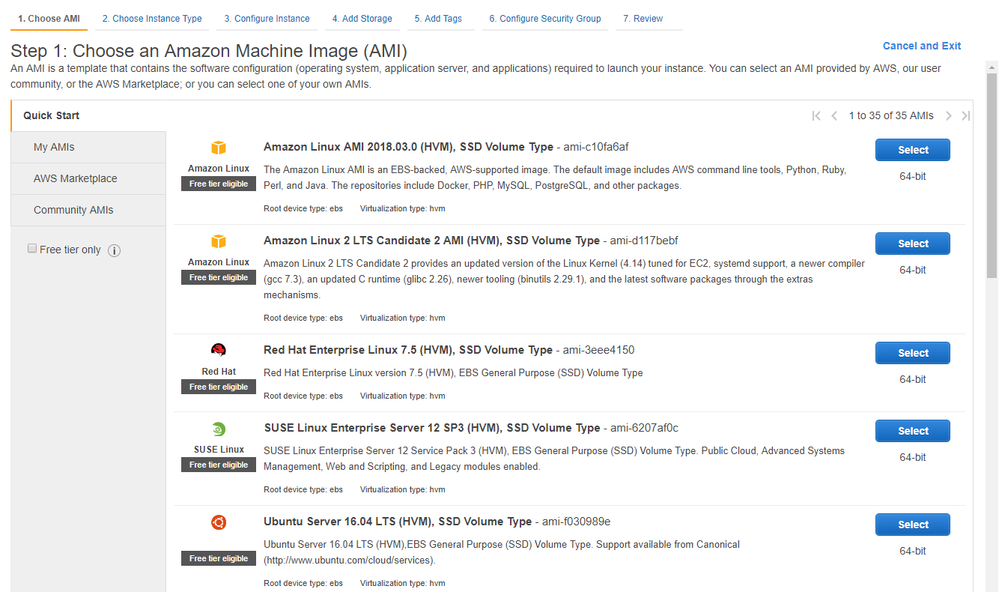
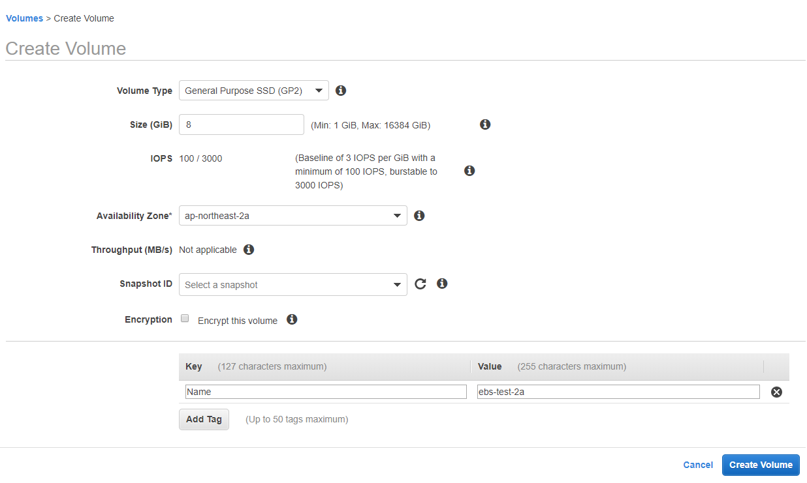
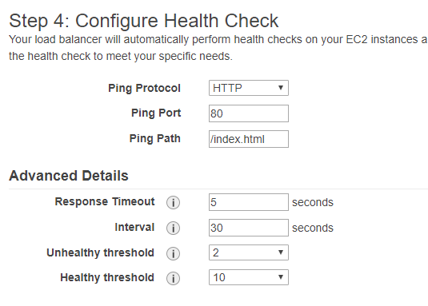

# EC2

## TOC

* [1. EC2 Instance](ec2.md#1-ec2-instance)
  * [1-1. Instance](ec2.md#1-1-instance)
  * [1-2. Launch Instance](ec2.md#1-2-launch-instance)
* [2. Images](ec2.md#2-images)
* [3. EBS](ec2.md#3-ebs)
* [4. Network & Security](ec2.md#4-network---security)
  * [4-1. Security Groups](ec2.md#4-1-security-groups)
  * [4-2. Elastic IPs](ec2.md#4-2-elastic-ips)
  * [4-3. Key Pairs](ec2.md#4-3-key-pairs)
* [5. Load Balancing](ec2.md#5-load-balancing)
* [6. Auto Scaling](ec2.md#6-auto-scaling)

## 1. EC2 Instance

EC2란 인터넷에 연결된 가상서버로, 가상서버이기때문에 모니터에는 직접 연결할 수 없고 터미널 또는 원격 데스크톱 연결로 접속해야 한다.

### 1-1. Instance

### 유형

사양 네이밍 규칙 : `{인스턴스타입}{세대}.{사양}` 예\) `t2.medidum`

* 범용 : `t`, `m`으로 시작하는 유형으로 주로 vCPU, 메모리 , 네트워크, 저장공간등이 평균적인 사양으로 제공
* 컴퓨팅 최적화 : `c`로 시작하며 메모리 대비 vCPU 비율이 높다
* GPU 인스턴스 : `p`로 시작하며 고성능의 NVIDIA GPU가 장착되어 있고 OpenCL등을 실행할때 사용
* 메모리 최적화 : `r`, `x`로 시작하며 메모리 용량이 다른 유형 대비 훨씬 크다.
* 스토리지 최적화 : `d`,`i`로 시작하며 스토리지 용량이 크거나 초고속 I/O를 제공한다.

> 참고
>
> `vCPU`는 가상화 소프트웨어\(혹은 하드웨어 가상화\)를 통해서 제공되는 CPU를 말한다.

### 구매옵션

* On Demand : 사용한만금 과금되며 1시간단위로 측정된다. 요금방식중 가장 비싸다.
* Spot : 경매 방식으로 입찰가격에 따라 유지된다. \(개발용으로만 사용\)
* Reserved : 예약금을 선불로 미리 결제하는 방식으로 1년,3년단위로 예약하며 **사양이 어느정도 특정되면 해당 옵션으로 변경해야 한다.**

### 1-2. Launch Instance

EC2 Instance 를 생성한다.

#### Step 1. Choose an Amazon Machine Image \(AMI\)

EC2 가상서버에 설치될 운영체제를 선택한다. 이때 미리 준비된 운영체제 이미지\(AMI\)만 사용할 수 있다.



Quick Start 탭은 AWS에서 가장 많이 사용하는 AMI들을 모아놓은 것으로 일반적인 OS들은 모두 목록에 있다.


기존 리소스로 만들어 놓은 AMI 를 이용해 EC2 인스턴스를 만들 수도 있다.

> 그외 AWS Marketplace등에서 다른 사용자가 올려놓은 AMI나 Quick Start에서 노출되지 않는 구버전의 OS들을 선택할 수도 있다.

#### Step 2. Choose an Instance Type

사용 용도에 맞게 다양한 인스턴스 유형을 제공하고 원하는 유형을 선택한다


> 사양은 추후 인스턴스 생성 이후에도 정지시킨 후 변경 할수 있다.

#### Step 3. Configure Instance Details


* `Number of Instances`: 생성할 인스턴스 개수
* `Purchasing option`: 스팟 인스턴스로 구매할 경우 체크
* `Network`: VPC 네트워크를 선택하는 옵션
* `Subnet`: 가용 영역\(Availability Zone\)을 선택하는 옵션
* `Public IP`: 공인 IP를 할당하는 옵션으로 Subnet 범위내에서 자동으로 부여된다.
* `IAM role`: IAM role 설정으로 공통적으로 적용시킬 role이 있을경우 선택한다. \(예 : tocloudwatchlogs - 서버 로그를 ec2로 보내기위한 role\)
* `Shutdown Behavior`: EC2 인스턴스안에 설치된 운영체제를 종료했을 때의 행동 옵션. Stop은 그냥 종료만 하고 Terminate는 종료 후 인스턴스를 삭제한다.
* `Enable Termination protection`: 실수로 삭제하는 것을 방지하는 옵션
* `Monitoring` : CloudWatch 세부 모니터링 사용 옵션.
* `Tenancy`: 가상 서버 실행 방식을 설정하는 옵션. 공유 인스턴스\(Shared tenancy\)와 전용 인스턴스\(Dedicated tenancy\)를 선택할 수 있다.
* `T2 Unlimited` : t2계열을 선택했을 경우에만 나타나는 옵션으로 기준성능을 넘어설 경우 선택한 사양이상까지 사용 가능하며 그만큼 추가요금이 부가된다.

> 하단에 `Advanced Details` 버튼을 누르면 `User data`라는 텍스트에어리어가 보이는데 여기에 인스턴스 실행\(생성\)시 딱 한번만 실행되는 쉘 스크립트를 작성할 수 있다.

#### Step 4. Add Storage

EC2 인스턴스에 장찰될 스토리지를 설정하며 Root 장치는 반드시 있어야 한다.


* Type: Root 장치\(Device\)인지 추가 장치인지 설정하는 옵션으로 Root 장치는 EBS만 사용할 수 있다.
* Device: Linux상에서 표시되는 장치 이름
* Snapshot: 스냅샷을 생성했을 때의 스냅샷 ID
* Size: 스토리지의 크기이며 기가바이트\(GiB\) 단위
* Volume Type: 스토리지 볼륨 유형
  * Magnetic: 하드디스크를 사용하는 스토리지\(평균적으로 약 100 IOPS\).
  * General Purpose: SSD를 사용하고, 1GiB당 3 IOPS를 제공하는 스토리지.
  * Provisioned IOPS: SSD를 사용하고, I/O 대역폭을 설정할 수 있다.
* IOPS: Volume Type을 Provisioned IOPS로 선택했을 때 IOPS 값을 설정할 수 있다
* Delete on Termination: EC2 인스턴스가 실행되고 있을 때 스토리지가 실수로 삭제되는 것을 방지하는 옵션

#### Step 5. Add Tags

Tag는 거의 모든 AWS 서비스에 존재하는데 Key-Value 형식이며 특별히 제한은 없다. 주로 요금확인과, 리스트에서 구별을 하기위해 최소한 Name 값은 입력을 해주는게 좋다.


#### Step 6. Configure Security Group

방화벽인 `Security Group`을 설정해준다.


> **OS단의 방화벽과는 별개의 방화벽**으로 보통 AWS Security Group의 방화벽 혹은 ACL로 보안 정책을 구성했을 경우 OS 단의 방화벽은 사용하지 않는다. 사용해도 무방하지만 관리의 불편함과 사실상 같은 기능을 두번 사용할 필요가 없다.

#### Step 7. Review

모든 설정을 마치고 Launch 버튼을 누르면 해당 인스턴스에서 사용할 keypair를 선택할 수 있고, 생성된 이후에는 key pair는 변경 할 수 없다.

> key pair를 분실 할경우 해당 key pair를 사용한 모든 자원에 접근할 수 없으니 주의


## 2. Images

`AMI(Amazon Machine Images)`는 EC2 인스턴스를 생성하기 위한 기본 파일로, EC2 인스턴스에 직접 OS를 설치 할 수 없고 AMI를 이용해야만 인스턴스를 생성할 수 있다.

> AMI는 OS 뿐만 아니라 여러가지 서버 애플리케이션, 데이터베이스, 네트워크 솔루션, 비즈니스 솔루션 등도 함께 설치 되어 있기도 하다

`AutoScaling과` `CloudFront`, `CodeDeploy` 등의 다른 서비스에서도 AMI를 이용하기도 하며, 인스턴스를 전혀 다른 리전으로 이전하거나, 기타 사용 솔루션을 사용할때 역시 필요하다.

> 가상화 소프트웨어\(VMware, Hiver-V\)등을 이용해 OS를 설치한뒤 VM 이미지를 AMI로 변환할 수도 있다 즉, Amazon Linux를 제외하면 AMI를 이용하여 온프레미스 환경에서도 사용이 가능하다 \(import/export\)

### Marketplace

마이크로소프트 스토어, 앱스토어 처럼 AMI를 사고 팔수 있는 스토어의 개념으로, OS만 설치된 AMI는 대부분 무료이며, 특별한 소프트웨어나 각종 상용 소프트웨어 혹은 커스터마이징된 소프트웨어등이 탑재된 AMI의 경우 월사용 요금을 지불하는 방식으로 사용할 수 있다.

### Create AMI

사용자 단에서 AMI를 만들 수 있는 방법은 크게 두가지이며, 여기서는 일반적으로는 많이 사용하는 EC2 인스턴스를 AMI로 생성하는 방법만 설명한다.

* EBS 스냅샷으로 AMI 생성

  > Linux Kernel ID를 알아야 한다.\(HVM인 t2유형은 제외\)

* EC2 인스턴스로 AMI 생성


AMI를 만들 EC2 인스턴스를 선택하고 상단의 Actions &gt; Image &gt; Create Image 순으로 누르면 이미 생성 팝업창이 뜬다


* Image name : AMI 이름으로 보통 원본 인스턴스 이름을 어느정도 표기해 구별해주는 편이 좋다 \(어차피 Name 태그로 구별을 하므로 크게 상관은 없지만 한글로 보거할경우 Name 태그는 안보이므로 가급적 명명규칙대로 \)
* Image descriptions : 단순 백업 용도인지, 특정용도인지, 테스트용인지 날짜별로 명시를 해주는 편이 좋다.
* No reboot : 인스턴스를 재부팅하지 않고 생성하는 옵션이지만 이럴경우 파일시스템 무결성을 보장하지 않는다.
* instance Volumes : 볼륨을 변경 및 추가 삭제 등을 할 수 있다.

> **파일시스템 무결성**을 보장하지 않는다? 쓰기 동작이 완료되지 않은 상태를 파일시스템 무결성이 깨진 상태라고 하는데 대부분은 큰 문제가 없이 복구 가능하지만 만의 하나 파일을 읽을 수 없거나 OS단에 문제가 생길 수 있으며, 재부팅을 하지 않고 AMI를 생성시 이를 보장하지 않는다는 뜻이다.


AMI생성후 확인해보면 Name 값이 비어있어 구별이 힘드니 `Name Tag`를 별도로 입력해준다.

> 생성과정에서 만든 `Image name`는 AMI Name으로 들어가 있다.

## 3. EBS

EC2 인스턴스에 장착해 사용할 수 있는 가상 저장장치로, EC2 인스턴스와 물리적으로 분리되어 있지만 EC2에서 그냥 일반적인 하드디스크\(혹은 SSD\)로 인식되고 성능\(IOPS\)등도 사용자화 할수 있으며, 인스턴스와 EBS 간의 지연시간은 거의 없다.

### 주 사용 목적

* 인스턴스에서 제공하는 기본 용량보다 더 사용하고 싶을 경우
* 운영체제를 중단시키지 않고 용량을 증설해야 할 경우
* 영구적인 데이터 보관이 필요할 경우

### EBS 기본개념

* Volume : EBS의 가장 기본적인 형태로 OS에서 바로 사용가능한 상태이다.
* Snaphot : EBS volume의 특정 시점을 그대로 복사하여 저장한 파일
* IOPS : 100 ~ 4000 IOPS 까지 설정 가능하다

> IOPS는 `16KB`단위로 처리되므로 작은 파일은 16KB 단위로 묶어서 처리하면 효율이 높다

### EBS 사용

EBS도 EC2 인스턴스와 마찬가지로 별도로 생성 할 수 있고, 별도로 생성한 EBS Volume을 instance에 붙여서 사용가능하다 EBS 생성은 [EC2 인스턴스 생성 단계](https://github.com/theminda/aws-setting/blob/master/AwsService/ec2.md#step-4-add-storage)와 거의 동일하다.



EBS Volume 리스트를 보면 모든 목록이 보이는데 `State` 가 `in-use`인 volume들은 현재 EC2 인스턴스에서 사용하고 있는 volume이며 사용가능한\(어디에도 연결되지 않은\) volume은 `avaliable`로 되어있다.


> EC2 인스턴스에는 최소 한개의 Root Volume이 필요하므로 해당 volume들은 연결된 상태에서는 삭제가 불가능하다.

`avaliable`상태인 volume을 선택한 후 상단의 Action 버튼을 누르면 `Attach Volume`이 활성화 되어있고 인스턴스를 선택하여 연결할 수 있다.


> 볼륨을 Attach 할경우 마운트 작업이 필요하지만 CentOS 6.X의 경우 추가적으로 volume 확장 작업이 필요하다 볼륨 확장은 [volume 확장 가이드](https://github.com/theminda/aws-setting/blob/master/CentOS-6.9/OS.md#6-3-기타-1) 를 참조

## 4. Network & Security

Security Group, Elastic IP, Key pair 등을 설정할 수 있는 메뉴

### 4-1. Security Groups

EC2 인스턴스에 적용할 수 있는 방화벽 설정으로 VPC의 Route table -&gt; Network ACL -&gt; Subnet 다음 단계로 적용된다. 서버 보안의 기본으로 온프레미스 환경에서는 보통 OS단의 방화벽\(iptables, firewall등..\)을 사용하지만 AWS는 같은 기능을 OS 단이 아닌 AWS 관리콘솔상에서 한번에 통제 할 수 있도록 보다 간편한 Security Group이라는 서비스를 제공한다.

Inbound, outbound, protocol type, port-port range 등은 개념은 기존의 방화벽과 특별히 다른건 없다.

### 4-2. Elastic IPs

고정된 공인 IP\(public ip\)를 말하며, EC2 인스턴스를 생성하면 기본적으로 공인 IP가 할당되지만, 인스턴스가 실행되고 있는 동안에만 유효하고 중단되면 IP가 반납되는 유동 IP이므로 고정 IP가 필요할 경우 `Elastic ip(이하 EIP)`를 사용한다. 또한 EC2 인스턴스 뿐만 아니라 특정 서비스에도 EIP를 연결 할수 있다 \(예 : NAT gateway\)

> IPv4 주소 체계는 Ip주소가 매우 부족하기 때문에 elastic ip를 생성하고 EC2 인스턴스에 연결하지 않을경우 요금이 부과된다. 즉, EIP를 생성하고 사용하는데는 요금이 부과되지 않지만 생성만 하고 사용하지 않을 경우에 요금이 부과된다.

### 4-3. Key Pairs

EC2에 접속하기 위해 사용하는 암호화된 파일로, AWS에서는 상대적으로 취약한 ID, Password 방식대신 `Key Pairs`을 통한 접속방식을 제공하며, RSA 공개 키 알고리즘\(Public Key Algorithm\)을 사용한다.


> 해당 알고리즘을 사용하는 키쌍 파일일 경우 Linux나 Mac Os 에서 생성한 키파일을 Import 하여 사용할 수도 있다. 예\) Github에 ssh키를 등록하기 위해 사용하는 `ssh-keygen -t rsa` 같은 명령어로 생성된 키파일을 AWS에서 `Key Pairs`로 사용할 수 있다.
>
> 같은 맥락으로 EC2 생성시만 `Key Pairs`파일을 선택가능하고 이를 바꾸는 기능은 없지만, SSH로 해당 인스턴스에 접속하여 `authorized_key` 파일을 수정하면 문제가 있긴하지만 공개 키에 한에 변경 가능하다.

## 5. Load Balancing

ELB\(Elastic Load Balancing\)는 부하분산과 고가용성을 제공하는 서비스로 고가의 L4/L7 장비 없이 간단한 클릭 몇번으로 생성할 정도로 간단하여 네트워크 담당자가 없어도 얼마든지 간단하게 설정이 가능한 만큼 서버 구축에 드는 노력과 비용이 많이 절감된다.

### ELB 특징

* 리전별로 생성해야 한다.
* 여러 가용 영역에 걸쳐 부하분산 처리를 할 수 있다.
* 서버 가동중인지 확인\(Health check\)를 조정 할 수 있다.\(빈도수, 프로토콜등..\)
* 외부 트래픽 뿐만 아니라 인터넷이 연결되지 않은 내부 네트워크에서도 사용 가능하다.

### ELB 기본개념

* `L4(OSI Layer 4)` : `TCP`, `UDP`등의 프로토콜이 대표적이며 포트번호로 구분하며,보통 OSI 레이어의 3번째인 네트워크 계층의 IP와 묶어서 처리한다. 즉 IP주소와 포트번호를 기준으로 트래픽을 분배한다.
* `L7(OSI Layer 7)` : OSI 7번째인 애플리케이션 계층으로 `HTTP` 프로토콜이 대표적이며 HTTP 헤더의 내용을 기준으로 트래픽을 분배한다.

> 기존에는 `L4`와 `L7`를 구분하지 않고 한가지 방식으로만 ELB를 생성했지만\(ELB 내부 설정에서 L4,L7을구분하는 방식\) 현재는 L4, L7을 구분하여 각각 L4는 `Network Load Balancer` L7은 `Application Load Balancer`, 그리고 기존의 혼합된 방식은 `Classic Load Balancer`라는 이름으로 아예 생성 시점부터 구분하도록 변경되었다. 민다는 Classic Load Balancer 사용


* `Health Check` : EC2 인스턴스가 정상인지 판별하는 기능으로 원하는 값으로 설정할 수 있다 \(예 : HTTP 80 port 로 domain.com/index.php 를 5분간격으로 확인\)
* `Connection Draining` : `Auto Scaling`과 연결했을 경우 사용자의 요청을을 처리중인 EC2 인스턴스를 바로 삭제하지 않도록 방지하는 기능 \(예: 사용자가 파일을 다운로드 하고 있을경우 다운로드가 완료될때까지 기다리고 그동안 새로운 커넥션은 받지 않는다.\)

### Create ELB

#### Step 1: Define Load Balancer


* `Load Balancer name`: 로드 밸런서 이름\(예: wisdom-web-elb\)
* `Create LB Inside`: 로드 밸런서가 생성될 VPC. \(VPC를 선택하면 자동으로 해당하는 서브넷 목록들이 하단에 노출된다.\)
* `Create an internal load balancer`: 인터넷에 연결되지 않은 내부 로드 밸런서로 생성하는 옵션으로 체크해제
* `Enable advanced VPC configuration`: VPC에 속한 서브넷을 선택하는 옵션으로 VPC에 생성되어있는 subnet들이 있을경우 비활성화 된다.
* `Listener Configuration`: 로드 밸런서가 처리할 프로토콜과 포트 번호
* `Select subnets`: elb에서 사용할 서브넷을 선택한다. \(예: `wisdom-elb-2a`, `wisdom-elb-2c` \)

#### Step 2: Assign Security Groups

Security Group을 선택하는 단계로 설정자체는 중복된 내용이므로 생략

#### Step 4: Configure Health Check

ELB의 헬스체크 기능 설정 단계



* `Ping Protocol` : 사용할 프로토콜을 설정 \(HTTP\)
* `Ping Port` : 포트 번호 \(80포트\)
* `Ping Path` : 헬스체크를 할 접속경로로 HTTP, HTTPS 프로토콜만 설정 가능하다.
* `Response Timeout` : 헬스체크 응답시간으로 여기서 설정한 시간이 지나도 응답이 없을경우 헬스체크를 실패했다고 판단한다.
* `Interval` : 헬스체크를 할 주기 \(예: 30초마다 헬스체크\)
* `Unhealthy Threshold`: 연속으로 설정한 값만큼 가동 확인에 실패했을 때 가동이 중단된 것으로 판단 \(예: 5초안에 응답이 두번없으면 트래픽 분산 중단\)
* `Healthy Threshold`: 가동이 중단되어 트래픽 분산에서 제외되었을 때 여기에 설정된 값만큼 가동 확인에 성공하면 다시 포함한다 \(예: 30초마다 5초안에 헬스체크를 10번 성공하면 정상가동으로 판단 \)

#### Step 5: Add EC2 Instances

ELB에 연결할 EC2 인스턴스를 선택한다.


* `Enable Cross-Zone Load Balancing`: 여러 가용 영역에 생성된 EC2 인스턴스에 부하를 분산하는 옵션으로 2a,2c 두 가용영역에 걸쳐 이중화가 필요할 경우 체크한다.
* `Enable Connection Draining`: 위에서 언급한 Connection Draining 사용 옵션. 1초부터 3600초\(1시간\)까지 설정할 수 있다.

> Step 6,7 은 설명이 필요없는 단계이므로 생략

## 6. Auto Scaling

트래픽이 늘어나면 자동으로 EC2 인스턴스를 추가 및 삭제하는 기능으로 ELB와 함께 사용된다.

### Auto Scaling 특징

* 별도의 사용요금은 없다.
* cloudwatch와 연동하여 인스턴스의 CPU 사용률등의 cloudwatch에서 지원하는 모든 Metric과 연동하여 측정 가능하다.
* AMI를 이용하여 서버를 증설한다.

Auto Scaling을 사용하기 위해서는 먼저 EC2 생성옵션 \(Launch Configuration\)을 만들어야 하며 생성과정은 EC2 인스턴스 생성과정과 동일하다.

> EC2 인스턴스와 생성과정이 동일하지만 `Launch Configuration`의 경우는 `User data`에 유의미한 셋팅값을 설정해줘서 기존의 EC2 인스턴스와 동기화 해주는 작업이 꼭 필요하다.
>
> 예\)
>
> ```bash
> # Auto Scaling으로 생성되는 서버들의 소스코드 동기화작업
> cd /home/{user}/www
> git pull
> ```

### Create Auto Scaling Group


위에서 생성한 생성옵션을 선택해준다.

#### Step 1. Configure Auto Scaling group details


* `Group name`: Auto Scaling 그룹의 이름 \(예: asg-wisdom-web\)
* `Group size`: 최초에 EC2 인스턴스를 생성할 개수
* `Network`: Auto Scaling 그룹이 생성될 VPC를 선택 \(예: wisdom-vpc\)
* `Subnet`: EC2 인스턴스가 생성될 서브넷설정. 빈 칸을 클릭하면 서브넷의 목록이 표시되며 웹서버에서 사용하는 서브넷을 선택해준다.\( 예: wisdom-web-2a, wisdom-web-2c\)

> Advanced Details 클릭

* `Load Balancing`: ELB 로드 밸런서를 사용하는 옵션. 
* `Classic Load Balancers`: 위내용을 체크하면 활성창이 생성되고, 빈 칸을 클릭하면 현재 생성된 ELB 로드 밸런서의 목록이 표시된다. \(예: wisdom-web-elb\)
* `Health Check Type` : Auto Scaling이 체크할 유형을 선택한다. \(EC2 선택\)
  * `ELB`: ELB 로드 밸런서에서 확인할 헬스체크 값을 사용 
  * `EC2`: Auto Scaling 그룹이 개별적으로 EC2 인스턴스의 헬스체크를 실행
* `Health Check Grace Period`: EC2 인스턴스가 활성화\(`InService`\) 되었을때 여기에 설정한 만큼 헬스 체크를 연기한다 \(인스턴스 활성화후 이뤄지는 작업때문에 정상적으로 오류가 아님에도 헬스체크가 안될경우를 대비하여\)
* `Monitoring`: CloudWatch 에서 세부 모니터링을 사용하고 싶을 경우 체크
* `Instance Protection`: `Protect From Scale In`을 선택할 경우 해당 인스턴스는 Auto Scaling으로 인해 삭제 되지 않도록 보호하는 옵션

#### Step 2. Configure scaling policies


* `Keep this group at its initial size`: 앞에서 설정한 EC2 인스턴스 개수를 유지
* `Use scaling policies to adjust the capacity of this group`: 설정한 정책에 따라서 EC2 인스턴스를 조절한다 \(그에 대한 설정은 하단에서\)
* `Scale between N and N instances`: EC2 인스턴스를 최대 몇 개까지 추가하고, 삭제하더라도 최소 몇 개까지 남겨둘지 설정\(이중화 구성이므로 최소 2 ~ N 개로 설정한다.\)

> 하단의 `Scale the Auto Scaling group using step or simple scaling policies` 를 클릭해서 증감 설정창을 불러온다.

* 증가 / 감소 조건을 각기 설정 할 수 있고 여러가지 조건을 묶을 수도 있다.
* CloudWatch Alarm을 여기서 생성할 수도 있고, 이미 생성되어 있는 알람을 불러올 수도 있다.


위의 예시는 5분내에 CPU 사용량의 측정치가 3번 이상 80%를 초과할 경우 1개의 서버 추가 반대로 5분내에 CPU 사용량 측정치가 3번 5% 이하로 측정될경우 1개의 서버 삭제 설정이다.

#### Step 3. Configure Notifications

Auto Scaling이 작동할때 알림을 받을 구성을 설정하는 단계


토픽을 생성하여 알림을 받을 메일등을 설정할 수 있고 어떤 단계\( 서버 추가, 삭제등..\)에서 알림을 받을지 설정 가능하다.

> 이하 단계 설명은 중복내용이므로 생략

### 기존 리소스와 AutoScaling 그룹 연결


연결할 EC2 인스턴스를 선택한 후 상단의 Actions &gt; Instance Settings &gt; Attach to Auto Scaling Group 을 차례로 누르면 연결 가능다.

> 이때 주의할점은 Auto Scaling Group의 Desired 값에따라 서버가 삭제될 수도 있으니 Auto Scaling이 어떻게 작동되는지 완벽하게 이해하기 전에는**절대로 운영 및 스테이징 서버로는 테스트 하지 않아야 한다**


