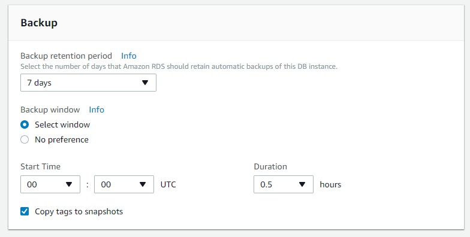

# RDS

## TOC

* [1. RDS](rds.md#1-rds)
* [2. RDS Create](rds.md#2-rds-create)
* [3. RDS Detail](rds.md#3-rds-detail)
* [4. Functions](rds.md#4-functions)
  * [4-1. Snapshot](rds.md#4-1-snapshot)
  * [4-2. Restore](rds.md#4-2-restore)  

## 1. RDS

관계형 데이터베이스\(`RDBMS`\)를 DB 전문 인력 없이, 시간과 비용을 절감할 수 있도록 도와주는 관리형 서비스로 장애를 대비한 이중화 구성, 스토리지 용량 IOPS등 성능 확장 Read Replica를 이용한 읽기 성능등을 보다 간편하게 설정 및 변경할 수 있다.

### RDS의 간단한 특징들

* 일반적으로 온프레미스 환경에서 사용하는 관계형 데이터베이스와 동일하다.
* 관계형 데이터베이스를 응용레벨에서만 이용한다고 생각하면 된다.
* 백업\(`Snapshot`\)설정이 간단하고 다른 리전에도 복사하여 사용가능\( 사실상 마이그레이션 과정이 생략\)
* VPC안에서 DB 인스턴스 실행 암호화가 가능하고 스토리지 레벨에서 암호화가 된다고 보면된다.\(엔진 레벨의 암호화도 상용 DB - \[`Oracle`, `MSSQL`\]등은 사용가능하다.\)
* 간편한 이중화 구성 \(`Multi-AZ`\)

### RDS Instace Class

EC2와 비슷하게 인스턴스라는 개념이 있으며 여러 사양으로 나뉘어져 있는데, 이를 DB인스턴스 클래스라고 한다.

사양 네이밍 규칙 : `db.{인스턴스타입}{세대}.{사양}` 예\) `db.t2.medidum`

* `micro` : 낮은 `vCPU`성능과 적은 메모리 \(`db.t1.micro`, `db.t2.micro` ...\)
* `standard` : `vCPU`, `Memory`, `Netword`등이 평균적인 사양으로 제공 \(`db.m3.medium`, `db.m3.2xlarge` ...\)
* `memory` : 메모리 용량이 큰 클래스 \(`db.m2.xlarge`, `db.m2.4xlarge`\)

## 2. RDS Create

### 2-1. Subnet group, Parameter groups, Option groups

편의상 DB 인스턴스를 만들기 전에 Subnet group, Parameter groups, Option groups를 먼저 만들어준다.

> DB 인스턴스 생성과정에서도 만들 수 있지만 id가 자동으로 부여되고, 원활한 관리를 위해 선행한다.

* `Subnet Group` : 가용영역에 속한 여러 개의 Subnet을 추가할 수 있고, VPC를 생성하고 EC2 인스턴스와 내부 네트워크를 구성하기 위해 반드시 **생성할 db인스턴스가 속할 가용영역을 추가**해줘야 한다.
* `Parameter groups` : DB 세부설정을 한곳에 모아놓은 것으로 해당 메뉴에서 설정을 전부 관리한다
* `Option groups` : DB 실행 옵션을 한곳에 모아놓은 것으로 Memcached 설정등을 할 수 있다.

위 메뉴의 세가지를 전부 미리 만들어 둔다. \(설정을 하는것이 아닌 단순히 생성만 한다. 세부설정은 추후 DB와 연결 이후에도 가능하다.\)

### 2-2. Launch DB instance

RDS instance는 Instances 탭의 `Lauanch DB instance`버튼을 클릭해서 생성한다.

### Step 1. DB Engine select

원하는 DB 엔진을 선택한다. \(상용 라이센스도 지원\)

### Step 2. Choose use case

Aurora를 사용할게 아니라면 첫번째 항목은 무시하고 `Production` 과 `Dev/Test`항목은 단순히 `Use Multi-AZ Deployment` 와 `Provisioned IOPS Storage` 항목의 자동 사용 여부를 구분하는 것으로 여기서 선택하더라도 다음 스텝에서얼마든지 변경 가능하니 아무거나 선택해도 무방하다.

### Step 3. Specify DB details

#### Instance specifications

* `License model`: mariaDB는 general-public-license만 선택가능
* `DB Engine Version`: 사용할 엔진 버전. \( MariaDB 10.1.31 \)
* `DB Instance Class` : 인스턴스 클래스
  * 운영DB : `db.m4.xlarge - 4 vCPU, 16GiB RAM`
  * 개발/테스트 DB : `db.t2.medium - 2 vCPU, 4GiB RAM`
* `Multi-AZ deployment` : 장애에 자동으로 대처하는 Failover 기능을 위한 다중 가용 영역 복제 옵션 \(운영DB에서만 사용한다.\)
* `Storage type` : 저장소 타입
  * `General Purpose (SSD)` : 광범위한 데이터베이스 워크로드에 적합.  `3 IOPS / GiB` 기준선과 `3,000 IOPS`로 버스트 하는 기능을 제공 \(테스트 DB 혹은 상황에 맞게\)
  * `Provisioned IOPS (SSD)` : `I/O` 집약적인 데이터베이스 워크로드에 적합. `1,000 ~ 30,000 IOPS` 범위의 I/O를 프로비져닝 할 수 있는 유연성을 제공한다. \(운영DB용 \)
* `Allocated Storage`: DB에서 데이터를 저장할 스토리지의 용량. 최소 `5GB`에서 `3072GB(3TB)`까지 설정 가능하다.
* `Provisioned IOPS` : 1,000 ~ 30,000 범위내에서 IOPS를 지정해준다.

#### Settings

* `DB instance identifier` : DB 인스턴스의 이름으로 같은 리전 안에서 중복될 수 없다.\( `wisdom-n2-1a`, `wisdom-v2-1a`\)
* `Master Username`: DB 관리자 계정입니다. \(`wisdom`로 설정\)

### Step 4. Configure advanced settings

#### Network & Security

* `VPC` : VPC를 선택 \( `wisdom-vpc` \)
* `Subnet group` : `Default-VPC`이외의 VPC를 선택했을때만 선택 가능하며, 미리 생성해둔 `Subnet group`을 선택해 준다.
* `Public accessibility` : DB를 외부 접근할 수 있게 해주는 옵션으로 **No**로 설정하면 VPC 내부에서만 접근 가능하며, **개발 단계/개발 DB에라도 해당 값은 반드시 No**로 선택해야 한다.
* `Availability zone` : DB 인스턴스가 생성될 가용영역으로 서버와 같은 가용영역에 있어야 지연시간이 단축된다고 하지만 사실상 큰 차이는 없다\(같은 VPC 내에서라면\)
* `VPC security groups` : ACL 다음에 작동하는 방화벽 설정으로 미리 만들어둔 항목을 선택하거나 새로 만든다

#### Database options

* `Database name` : 생성할 DB 이름으로 아무것도 입력하지 않으면 DB인스턴스에 Maria 서버만 실행되고 DB는 생성되지 않는다. \(운영 : n2, 개발 : v2\)
* `Database port` : 접속 port 설정
* `DB parameter group` : Maria를 실행할 때 필요한 파라미터 집합으로 미리 만들어둔 것을 선택해준다. \(my.cnf 파일을 생성하는 것과 동일\)
* `Option group` : MySQL과 Maria는 특별히 지정하지 않아도 무방하다.

#### Backup

백업 설정

* `Backup retention period` :  백업 데이터 유지기간으로 최대 35일까지 설정 가능하다
* `Backup window` : 백업 시간으로 UTC 기준으로 백업을 실시한다. 주로 Maintenace Window 시간과 겹치지 않게 하고 싶을경우 설정한다.

#### Monitoring

`Enable enhanced monitoring` 사용을 활성화 할 경우 여러 프로세스나 쓰레드가 CPU를 어떻게 사용하는지 확인 가능하고 Role을 설정해줘야 한다. \(미리 해당 용도로 만들어 놓은 [rds-monitoring-role](https://console.aws.amazon.com/iam/home?region=ap-northeast-2#/roles/rds-monitoring-role) 사용\)

#### Log exports

`Cloudwatch log` 로 보내고 싶은 로그를 체크한다. `Error log`와 `Slow query log`의 경우 여기서 체크를 해줘도 **parameter group 에서 별도로 활성화를 해줘야 한다.**

#### Maintenace

마이너 버전 자동업그레이드 기능으로, 현재 사용하지 않으므로 비활성화

## 3. RDS Detail

### Endpoint 확인

db 인스턴스의 상세 화면으로 진입후 스크롤을 내리면 Connect 섹션에서 접속가능한 Endpoint를 확인할 수 있다.

### Details

Details 섹션에서 DB 인스턴스의 설정값들을 상세히 확인할 수 있고 `Modify`버튼을 눌러서 설정값을 변경 할 수 도 있다.

> 그외 `CloudWatch alarms`, `Snpashot`, `Tags`, `Logs`, `Replication` 등을 확인 할 수 있다.

## 4. Functions

RDS의 관리형 서비스

### 4-1. Snapshot

RDS의 Snapshot은 DB 전체 내용 중 특정 시점을 파일로 저장한 형태로 DB 인스턴스 생성시 설정한 자동백업[Backup](rds.md#backup) 과는 다르다

* DB 자동백업 : DB 인스턴스를 삭제하면 자동 백업도 함께 삭제된다.
* DB 스냅샷 : DB 인스턴스를 삭제하더라도, DB 스냅샷은 계속 유지되며, 다른 리전으로 복사할 수도 있다.

Take snapshot 버튼을 클릭하여 생성 가능하며 약 4분 내외의 시간이 소요된다.

> `Multi-AZ` 를 사용하고 있을 경우 예비 인스턴스\(standby\) 인스턴스에서 스냅샷을 생성하므로 현재 운영중인 메인 인스턴스의 `I/O` 성능에 전혀 영향을 주지 않는다.

### 4-2. Restore

RDS의 복구는 크게 두가지 방식이 있는데, 스냅샷을 통한 새로운 DB 인스턴스를 생성하는 방법과 자동백업[Backup](rds.md#backup)설정을 통해 DB의 특정시점을 기준으로 새로운 DB 인스턴스를 생성하는 방법이다.

#### 스냅샷을 통한 복구

원하는 스냅샷을 선택후 상단 액션 버튼을 누르면 나오는 항목에서 `Restore Snapshot`을 선택하면 된다.

#### 특정시점으로 복구

DB 인스턴스를 선택 후 상단 `Instance actions`버튼을 누르면 나오는 항목에서 `Restore to point in time`을 선택한다.

db 인스턴스 생성이나 스냅샷을 통한 복구와 달리 최상단에 `Restore time`이라는 섹션이 추가되어 있고 여기서 원하는 시점으로 복구 할 수 있다.

