# VPC

## TOC

* [1. VPCs](vpc.md#1-vpcs)
  * [1-1. VPC](vpc.md#1-1-vpc)
  * [1-2. VPC Create](vpc.md#1-2-vpc-create)
  * [1-3. VPC Detail](vpc.md#1-3-vpc-detail)
* [2. Subnets](vpc.md#2-subnets)
  * [2-1. Subnets Create](vpc.md#2-1-subnets-create)
  * [2-2. Public\_Private Subnet](vpc.md#2-2-public-private-subnet)
  * [2-3. Subnet list](vpc.md#2-3-subnet-list)
* [3. Internet Gateways](vpc.md#3-internet-gateways)
* [4. NAT Gateways](vpc.md#4-nat-gateways)
  * [4-1. NAT Gateway Rules and Limitations](vpc.md#4-1-nat-gateway-rules-and-limitations)
  * [4-2. NAT Gateway create](vpc.md#4-2-nat-gateway-create)
* [5. Route Tables](vpc.md#5-route-tables)
  * [5-1. Route Table create](vpc.md#5-1-route-table-create)
  * [5-2. Routes](vpc.md#5-2-routes)
  * [5-3. Subnet Associations](vpc.md#5-3-subnet-associations)

## 1. VPCs

### 1-1. VPC

`VPC`는 기본적으로 내부에서만 통신가능한 사설 네트워크 이므로 게이트웨이로 라우팅 규칙을 세팅해서 통신하는데, 자체 IP주소 범위, 서브넷 생성, 라우팅 테이블 및 네트워크 게이트웨이 구성등 가상 네트워킹 환경을 제공해주는 서비스로 `EC2`를 포함 거의 모든 AWS상의 리소스에 필수조건으로 들어가야 한다.

또한 복잡한 네트워크 구성을 네트워크 관리자 없이 `관리 콘솔(Management Console)`과 `aws Cli` 상에서 설정할 수 있도록 제공하며,

일반적으로 아무리 작은 규모의 환경이더라도, 인터넷에 액세스할 수 있는 웹서버를 위한 `public subnet`, 인터넷 액세스가 없는\(혹은 하면 안되는\) 데이터베이스나 `WAS`등의 구성을 `private subnet` 서브넷에 할당하는 용도로 사용하며 그외 `Network ACLs`, `VPN`, `Security Group`등 다양한 서비스를 제공한다.

#### `VPC`의 대표적 특징

* `VPC`는 리전별로 생성
* `subnet`은 가용영역별로 생성
* `VPC`와 `subnet`은 CIDR 표기법으로 IP대역을 설정

#### `VPC`가 제공하는 보안

> * Security Group : 인스턴스 기반의 보안그룹
> * Network ACL\(액세스 제어 목록\) : 네트워크 기반의 방화벽으로 제일 앞단에 있는 방화벽 서비스
> * Key pair

#### `VPC`의 보안 프로세스

> Route table -&gt; Network ACL -&gt; Subnet -&gt; Security Group

### 1-2. VPC Create

기본적으로 생성되어 있는 `default-vpc`는 사용하지 않고 새로운 vpc를 만들어서 사용한다.

> `Code*`시리즈나 `Cloud9`등의 몇몇 서비스 구성시 `default-vpc`가 없을 경우 절차가 한 단계 더 생기는 경우가 있어서 기존 vpc는 지우지 않는다.

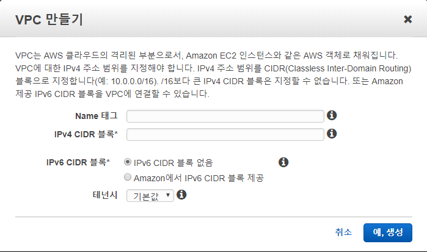

`Name Tag`는 리스트에 노출되는 Tag명으로 일반적으로 기업 혹은 서비스 명을 따서 명명한다.

> 예\) wisdom-vpc

`IPv4` 와 `IPv6`형식을 모두 지원하며 사이더\(CIDR\) 블록형태로 작성하며, `VPC CIDR`블록의 크기는 /16 에서 /28까지 가능하다 **\(IPv4 기준\)** `VPC`는 리전의 모든 가용영역에 적용되며, `VPC`생성 후 각 가용영역에 하나 이상의 서브넷을 추가 할 수 있다.

> CIDR은 Classless Inter-Domain Routing의 약어로 IP 주소 할당 방법이다. 급격히 부족해지는 IPv4 주소를 보다 효율적으로 사용하기 위해 CIDR 표기법을 사용하며, xxx.xxx.xxx.xxx/yy 형태로 표기하는데 맨 뒤의 yy는 Subnet Mask를 2진수로 바꾸었을 때 1의 개수이다. 255.255.255.0을 2진수로 바꾸면 11111111.11111111.11111111.00000000이 되는데 이를 CIDR 표기법으로 하면 xxx.xxx.xxx.xxx/24가 된다.
>
> 예\) `192.168.0.0/24`라면 `192.168.0.1`부터 `192.168.0.254`까지 \(192.168.0.0는 네트워크 192.168.0.255는 브로드캐스트\).
>
> `192.168.0.15/32`이면 1이 32개이고 Subnet Mask가 255.255.255.255가 되므로 , 즉 `192.168.0.15` 한 개의 IP를 뜻한다.
>
> 더 자세한 `CIDR` 표기법은 [RFC 4632](https://tools.ietf.org/html/rfc4632)를 참조

### 1-3. VPC Detail

vpc 작성 예시

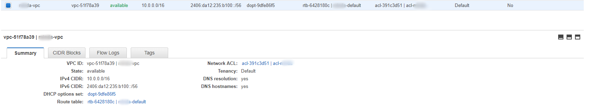

## 2. Subnets

각각의 서브넷은 단일 가용영역 내에서만 존재해야 하며 \(`ap-northeast-2a` 혹은 `ap-northeast-2c`\) 각 가용영역은 다른 가용 영역에서 발생한 장애를 격리시킬 수 있도록 서로 분리된 공간간으로 AWS는 각 서브넷에 고유 ID를 할당한다.

### 2-1. Subnets Create

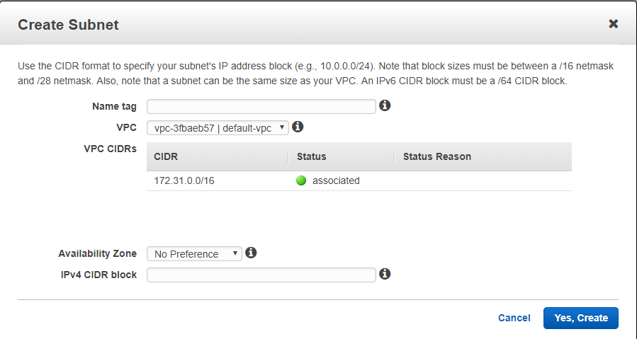

`Name Tag`는 리스트에 노출되는 Tag명으로 일반적으로 서브넷 사용 용도와 가용영역을 결합하여 명명한다.

> 예\) `wisdom-db-2a`, `wisdom-db-2c`

먼저 생성한 `VPC`를 선택한 후 가용역역과 `CIDR`블록을 VPC에서 지정한 범위 내에서 지정해준다. `VPC`와 마찬가지로 `CIDR`블록의 크기는 /16에서 /28 까지 가능하다

### 2-2. Public\_Private Subnet

일반적으로 `Internet Gateway`로 라우팅되는 `Public subnet`이라고 하며, `public subnet`의 인스턴스가 IPv4를 통해 인터넷과 통신할 수 있게 하려면 인스턴스에 public IPv4주소 또는 `Elastic IP`가 있어야 한다.

`Internet Gateway`로 라우팅되지 않는 서브넷을 `Private subnet`이라고 하며, `Virtual Private Gateway`로 라우팅시켜 `VPN`전용 서브넷을 구성할 수 있다.

> `subnet`의 유형과 관계없이 `subnet`의 내부 IPv4 주소 범위는 항상 `private`으로 인터넷으로 주소 블록을 알리지 않는다.

### 2-3. Subnet list

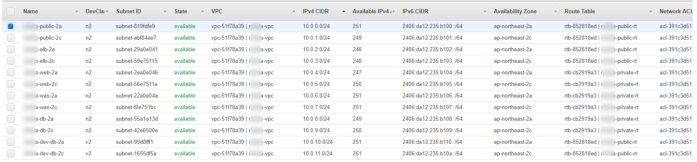

## 3. Internet Gateways

`VPC`와 인스턴스 간에 통신을 가능하게 해주고, 해당 트래픽에 대한 `route table`에 연결하여 사용하며, `Public IPv4`가 할당된 인스턴스에 대해 `NAT`를 수행하게끔 하는 두가지의 목적이 있다.

`Internet Gateway` 생성은 단순히 Name Tag만 작성해주는걸로 끝나며, 이렇게 생성시 연결이 안되어 있으므로 `VPC`와 `Attach`해줘야 한다.

> detached 상태

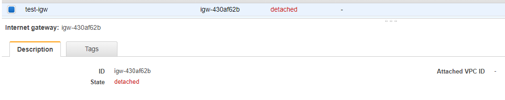

상단 **Action** 버튼을 누른 후 **Attach to VPC**를 선택해서 `VPC`를 연결해준다

> attached 상태

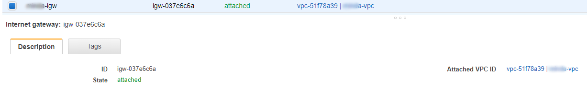

## 4. NAT Gateways

일반적인 IT 용례에 따른 `NAT`와 동일하지만 AWS에서는 추가적으로 `NAT 디바이스`라 지칭하며 `NAT gateway`와 `NAT instance` 를 포함하고 있으며 기능은 주소변환과 포트주소 변환을 모두 담당하는것을 같다.

`NAT 게이트웨이`가 `NAT 인스턴스`보다 우수한 가용성과 대역폭을 제공하므로 AWS에서 `NAT`라고 하면 보통은 `NAT gateway`를 말한다.

### 4-1. NAT Gateway Rules and Limitations

`NAT Gateway`의 대표적인 특성과 제한은 다음과 같다.

* NAT 게이트웨이는 5Gbps의 대역폭을 지원하며 최대 45Gbps까지 자동 확장한다. 
* 하나의 `Elastic IP` 주소만 `NAT Gateway`에 연결할 수 있으며, 연결된 후에서는 연결을 끊을 수 없다.
* `TCP`, `UDP`, `ICMP`등의 프로토콜을 지원한다.
* 각 고유 대상에 대해 최대 55,000개의 동시 연결을 지원한다.
* `Security Group`을 `NAT Gateway`와 연결할 수 없는 대신, 해당 `Security Group`이 할당된 인스턴스에서 주고받는 트래픽을 제어할 수 있다.

> 만약 지원 대역폭을 이상의 자원을 원할경우 `NAT Gateway`를 단일로 구성하는 것이 아닌 리소스를 여러 서브넷으로 분할하고 각 서브넷마다 `NAT Gateway`를 만들어 워크로드를 분산할 수 있다.

### 4-2. NAT Gateway create

public 용으로 미리 구성해 놓은 `subnet`을 선택하고 `Elatic IP`주소를 할당한다. 미리 만들어 놓은 `Elatic IP`가 없을 경우 이 화면에서 Creat New EIP 버튼을 눌러서 바로 생성후 연결 할 수도 있다.

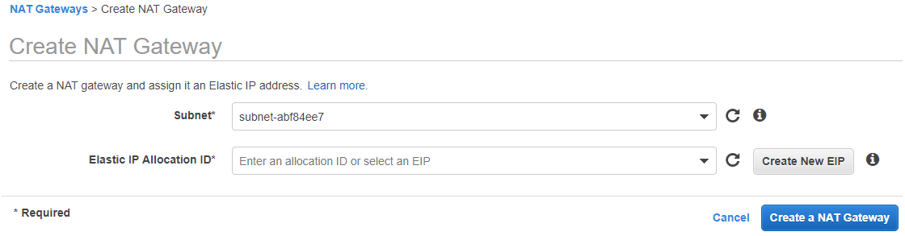

> `NAT Gateway`

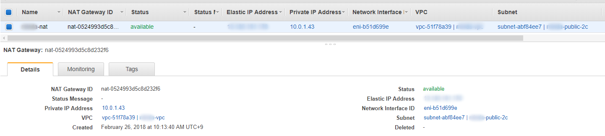

## 5. Route Tables

네트워크 트래픽을 전달할 위치를 결정하는데 사용되는 규칙 집합의 모음 `VPC`의 각 `subnet`을 `route table`에 연결해야 하며, 여러 서브넷을 동일한 `Routing table`에 연결할 수 있다. 만약 `Subnet`을 특정 `route table`에 연결하지 않을 경우 기본 `route table`에 암시적으로 연결된다.

서비스 범위를 최소화 하여 단독 `VPC`를 사용할 경우 일반적으로 `public`과 `private` 테이블을 각각 한개씩 구성하여 모든 서브넷을 연결 할 수 있다.

### 5-1. Route Table create

단순히 Name Tag만 입력하고 `VPC`만 선택해주면 생성되며, `NAT`, `Internet Gatewat`, `subnet`연결등은 생성 이후 작업할 수 있다.

보통 public, private 를 구별할 수 있도록 명명한다.

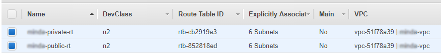

### 5-2. Routes

생성한 Route table 하단의 Routes 탭을 눌러 미리 생성한 `Internet Gateway`와 `NAT Gateway`를 용도에 맞게 연결해준다.

* public route table : Internet gateway
* private route table : NAT gateway

기본적으로 IPv4와 IPv6 가 할당되어 있고, Target 부분을 클릭하면 미리 만들어둔 리소스가 표시되고 상기 규칙대로 선택해준다.

> public route table 의 routes

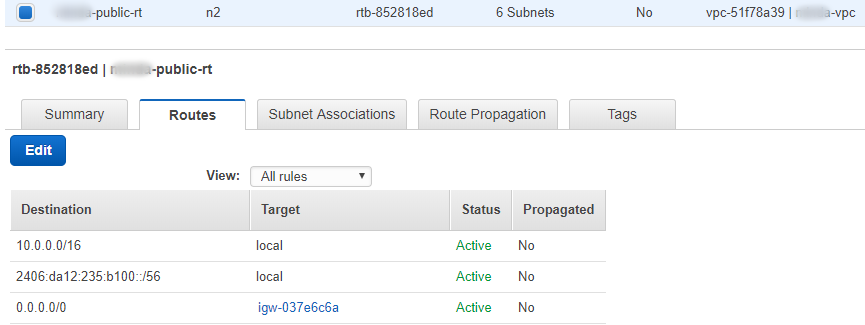

> private route table 의 routes

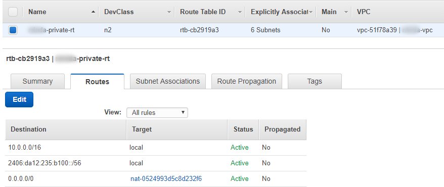

### 5-3. Subnet Associations

Subnet을 route table에 연결해준다. 실제로 subnet만 생성해서는 사용이 안되고 지금 단계에서 route table을 통해 연결을 해줘야 vpc내부에서 맵핑이 된다.

설정은 Edit 버튼을 누른후 단순히 용도에 맞게 체크만 해주면 된다

> public route table Associations

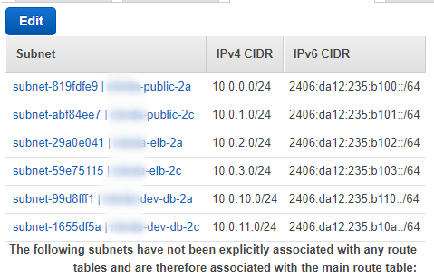

> private route table Associations

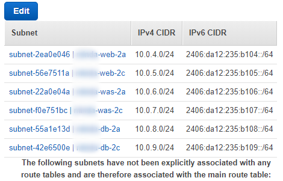

