# Connect

## 1. SSH

`bastion` 서버를 경유한 터널링을 통해 웹서버에 접근한다.

### 1-1. Aws Management Console

SSH 접속에 필요한 정보는 다음과 같다

* 터널링 서버의 `Elastic IP`\(고정IP\) - `elastic ip`는 별도로 연결했다는 가정하에
* 웹서버의 `Private IP`\(사설IP\)
* 생성한 Instance의 `key pair`\(`*.pem` or `*.ppk`\)
* instance OS별 기본계정

먼저 `Instance`의 `IP` 정보와 `key pair name`은 관리콘솔의 상단 `Service` &gt; `EC2` &gt; `Instances` 탭에서 확인 가능하다

`Elastic IP`가 할당된 경우 자동으로 `Public IP`도 같은 `IP`로 할당된다

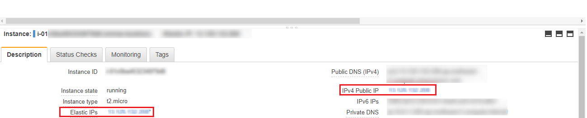

목적지 웹서버의 경우 `instance`를 중지-가동 할경우 public IP가 변하고 고정 IP를 연결하는 것이 아닌 `ELB`와 연결하므로 `Private IP`를 사용한다. 해당 `instance`의 key pair 이름도 같은 화면에서 확인 가능하다.

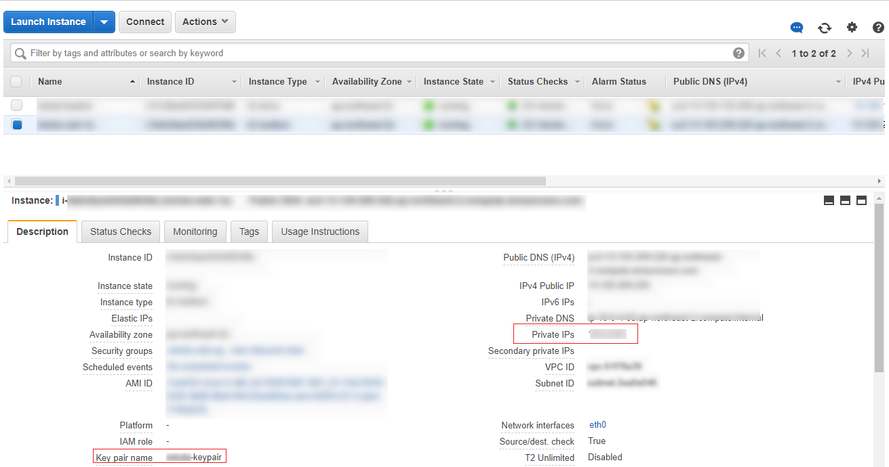

> 키파일은 관리자에게 상기 이미지의 `key pair(.pem)`파일을 요청하여 사용한다.

### 1-2. Window 에서 SSH 접속

윈도우 환경에서는 `Putty` 혹은 `MobaXterm`\(추천\)등의 터널링을 지원하는 외부 프로그램을 사용하여 접속한다.

[MobaXterm 다운로드 페이지](https://mobaxterm.mobatek.net/download.html)에서 무료버전을 다운받는다

두가지 방법중 편한 방법으로 셋팅한다.

1. SSH 세션 설정상에서 터널링 설정을 이용한 방법
2. 자체 터널링옵션을 On-Off 하며 바로 목적지 서버로 접속하는 방법

#### 1-2-1. SSH 세션 설정상에서 터널링 설정을 이용한 방법

`SSH` 세션 설정상에서 경유 서버와 목적지 서버를 지정하여 연결하는 방법

1. 상단의 `Session(1)`아이콘 클릭
2. 팝업창의 `SSH(2)`아이콘을 클릭
3. `Remote host(3)`에 목적지 웹서버의 `Private IP` 입력
4. `Specify username`에 체크 및 목적지 서버의 기본계정, SSH 포트 입력

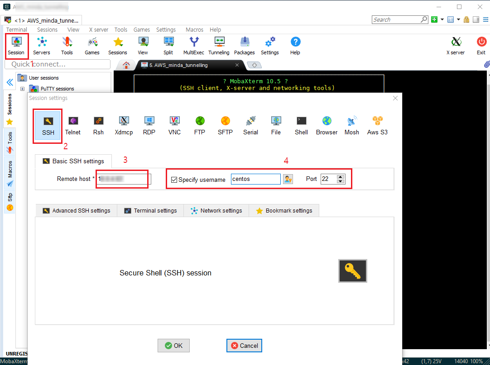

> 각 OS별 기본생성되는 계정은 다음과 같다
>
> * Amazon Linux AMI의 경우 사용자 이름은 ec2-user
> * Centos AMI의 경우 사용자 이름은 centos
> * Debian AMI의 경우 사용자 이름은 admin 또는 root
> * Fedora AMI의 경우 사용자 이름은 ec2-user
> * RHEL AMI의 경우 사용자 이름은 ec2-user 또는 root
> * SUSE AMI의 경우 사용자 이름은 ec2-user 또는 root
> * Ubuntu AMI의 경우 사용자 이름은 ubuntu 또는 root

1. `Advanced SSH settings` 탭 클릭
2. `Use private key` 체크
3. `*.pem` 키페어 파일 등록

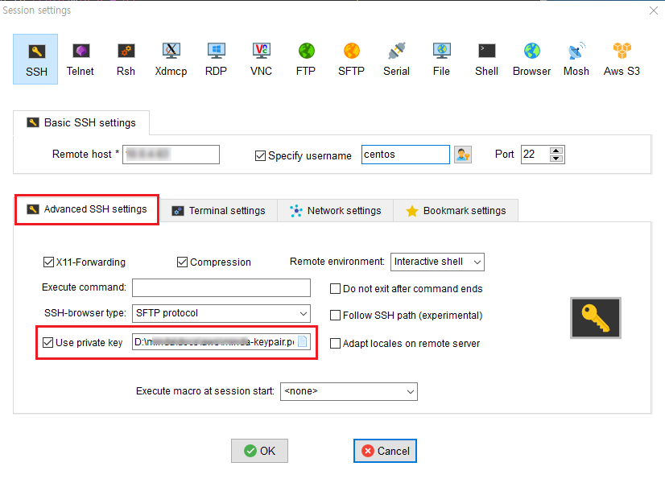

1. 'Network settings\` 탭 클릭
2. `Connect through SSH gateway`체크
3. `Gateway SSH server`에 터널링 서버의 `Elastic IP`입력
4. SSH 포트, 터널링 서버의 기본계정\(ec2-user\)입력
5. `Use private key`체크 및 `*.pem` 키페어 파일 등록

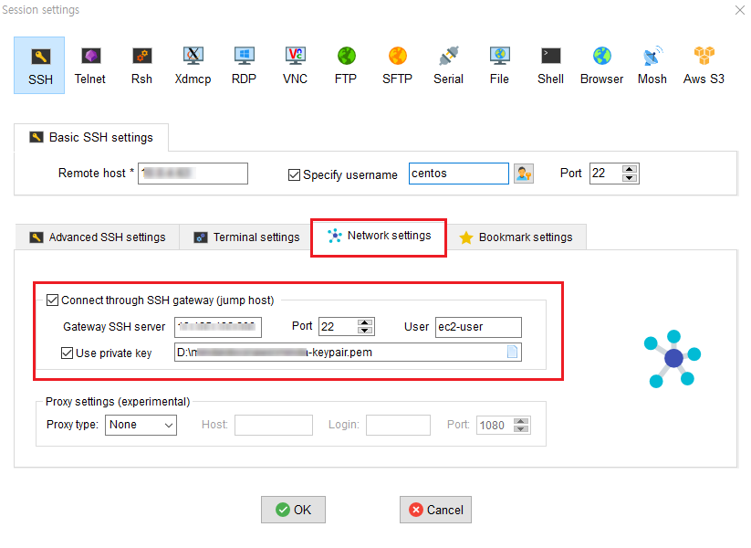

#### 1-2-2. 자체 터널링옵션을 On-Off 하며 바로 목적지 서버로 접속하는 방법

`MobaXterm` 자체에서 지원하는 터널링 값을 유동적으로 껏다 키며 SSH에서 별도의 목적지 경유지 서버 설정없이 한번에 목적지\(웹서버\)서버로 접근하는 방법

1. 상단의 `Tunneling`아이콘 클릭
2. 팝업창 하단 `New SSH tunnel`클릭

`Local port forwarding`설정에 경유서버\(터널링서버\)와 목적지서버\(웹서버\)의 `IP`를 1-2-1번 방법과 동일하게 입력한 후 저장을 한다.

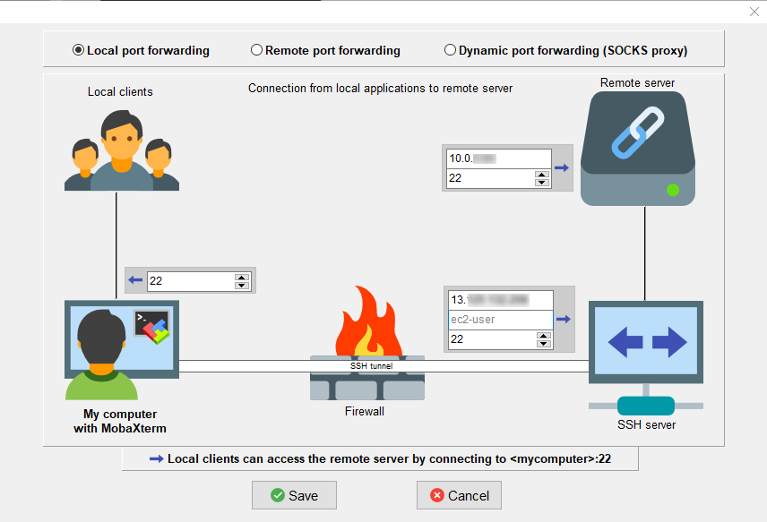

터널링을 Start하면 터널링서버 세션에 연결시 자동으로 목적지 서버로 접속된다.

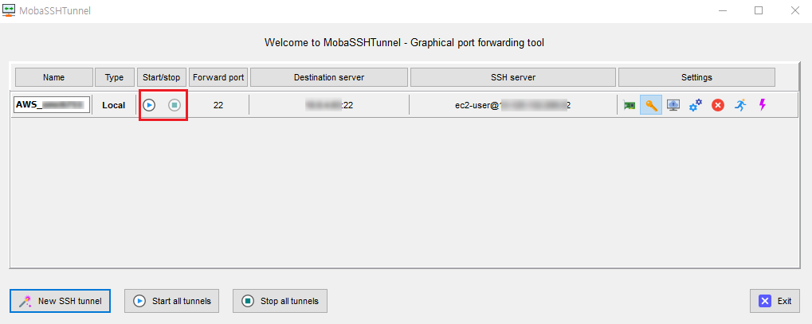

#### 1-3. Mac 에서 SSH 접속

\(추후 작성\)\`

## 2. RDS

`workbench`등의 외부 관리 툴을 통해 `RDS instance`에 접근한다.

### 2-1. Aws Management Console

RDS 접속에 필요한 정보는 다음과 같다

* `RDS instance`의 `Endpoint`
* 터널링 서버의 `Elastic IP`\(고정IP\)와 사용자계정
* 생성한 Instance의 `key pair`\(`*.pem` or `*.ppk`\)
* `RDS instance`  생성시 만든 `RDS`의 `username`과 `password`

관리콘솔의 `Service` &gt; 좌측 `instance`탭 &gt; `instance` 상세에서 스크롤을 조금 내리면 `Endpoint`를 확인할 수 있다.

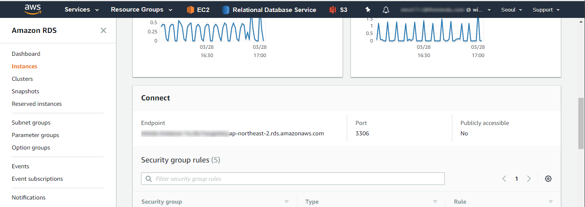

> `RDS`의 사용자 계정과 비밀번호는 관리자에게 문의 한다.

### 2-2. workbench

하기 이미지를 참고하여 SSH 터널링을 통한 RDS 설정을 해준다.

1.`Connection Method` 를 `Standard TCP/IP over SSH`로 변경한다. 2. 터널링서버 정보를 입력해준다. 3. 터널링 서버는 비밀번호 없이 `key pair`로만 인증하므로 비밀번호는 제거해준다. 4. `RDS`의 `keypair(*.pem)`파일을 등록해준다. 5. `2-1`에서 확인한 `RDS`의 `Endpoint`를 입력 6. RDS의 정보를 입력해준다. 7. RDS 계정은 사용자계정과 비밀번호로 인증하므로 비밀번호를 셋팅해준다.

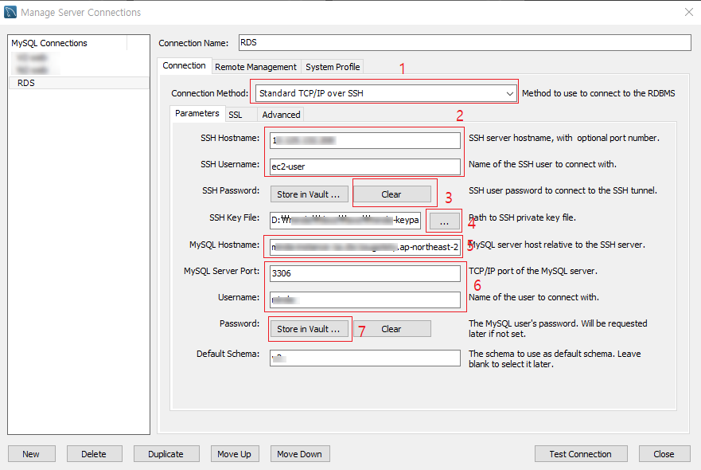

## 3. S3

`HTTP/S` 기반 액세스로 표준기반 `REST API` 및 `SOAP`인터페이스를 제공한다. S3 업로드를 지원하는 외부 툴을 이용해 파일업로드 및 액세스를 한다.

### 3-1. Aws Management Console

`IAM` 에서 다운받은 CSV 파일을 참조하여 본인의 `Access key`와 `Secret key`가 필요하다

### 3-2. S3 GUI Tools

#### 3-2-1. cyberduck

`Mac` 과 `Window` 환경 모두 사용가능한 `FTP` 툴로 `S3`를 지원한다 사용자 액세스키와 시크릿키를 이용해서 접속할 수 있고 IAM 유저로 접속할 수도 있다.

> 이 때 사용자는 `Amazon S3 FullAccess`, `CloudFront Full Access`권한이 필요하다

[cyberduck 다운로드페이지](https://cyberduck.io/)

> 그 외 S3를 지원하는 프로그램 목록
>
> * [CrosssFTP Pro](http://www.crossftp.com/amazon-s3-client.htm)
> * [FileZilla Pro](https://offers.filezilla-project.org/redirect.php?c=fzpro_win&s=l)
> * [Smartftp Enterprise Edition](https://www.smartftp.com/)
> * [S3 Browser](http://s3browser.com/)
> * [Cloudberry](https://www.cloudberrylab.com/explorer/amazon-s3.aspx)

1. 새연결 혹은 책갈피생성 화면에서 `Amazon S3`를 선택
2. 접근 키 ID에 본인의 `Access key` 입력 -&gt; 비밀번호 자동생성\(`Secret key`\)
3. 추가옵션에서 다운로드 경로와 기본접근 루트 경로 설정등을 할 수 있다.

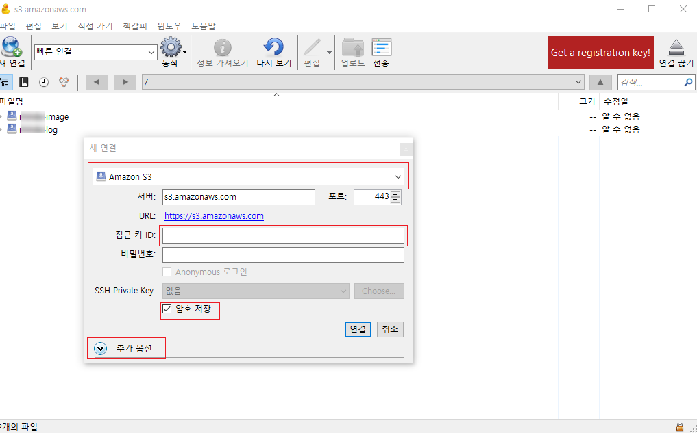

#### 3-2-2. s3 Browser

본인의 액세스키와 시크릿 키를 입력하면 `IAM`에서 설정된 S3권한에 맞게 작업이 가능하다

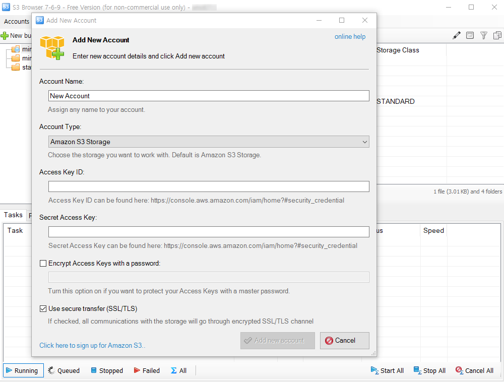

