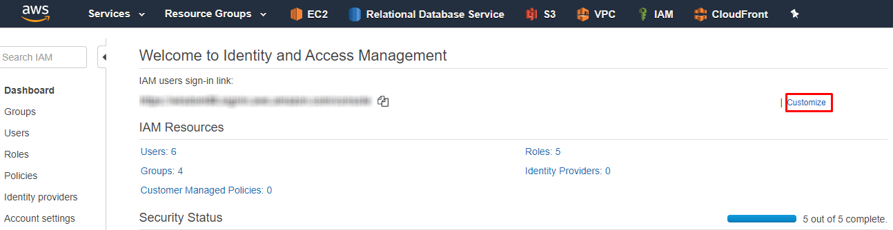
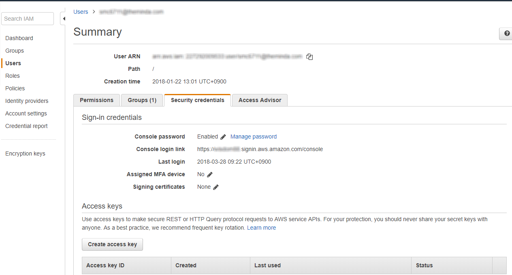
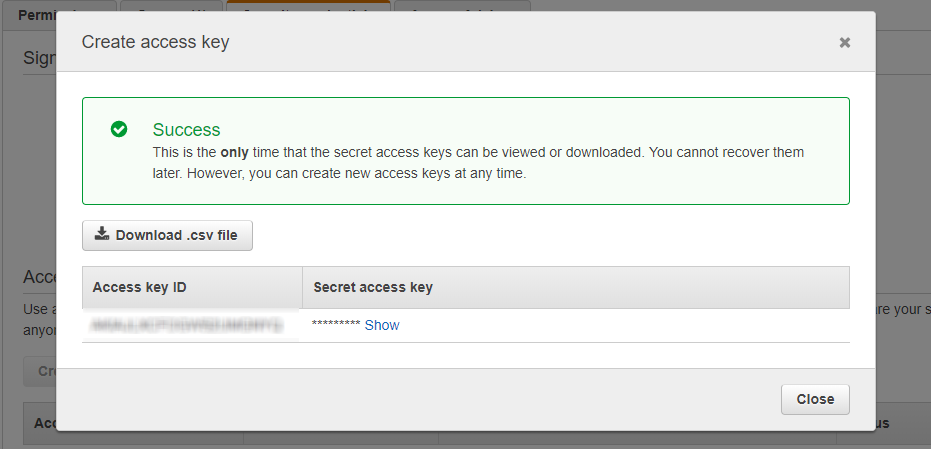

# IAM

## 1. 아이디 생성 및 권한 그룹

신규 계정 생성시 관리자 권한을 가지고 있는 **관리자 계정**`dev@theminda.com`으로 작업한다. 기술연구소 정책에 따라 사용자 권한을 부여받고, 권한 외의 작업은 **최소권한의 원칙**에 따라 추가적으로 **관리자**에게 `Role`을 요청하여 작업한다.

> 공통 사용 계정 혹은 권한을 유동적으로 바꿀경우 AWS console 상에서 누가 어떤작업을 왜 했는지 알수가 없으므로 기본적인 `developer`와 같은 그룹내에 속해 있고 그 외 작업은 Role을 생성 및 부여 받아 작업을 하면 추후 `CloudWatch` 와 같은 서비스에서 로그 목록을 보다 쉽고 명확하게 조회 가능하다.

### 1-1. Groups

| 그룹명 | 권한 |
| :--- | :--- |
| admin | AdministratorAccess |
| developer | AmazonRDSFullAccess, AmazonEC2FullAccess, AmazonElastiCacheFullAccess, AutoScalingFullAccess, AmazonS3FullAccess, CloudFrontFullAccess, AWSElasticBeanstalkFullAccess, AmazonGlacierFullAccess, AmazonRoute53FullAccess |

### 1-2. Roles

최소권한의 원칙을 달성하기 위한 방법중 하나를 제공해주는 서비스

특정 용도\(트러블슈팅, 모니터링\)를 수행할 사용자를 지정하여 사용 할수 있으며, 사용자 뿐만 아니라 그룹에도 부여가 가능하다.

이때 `Role`을 부여받은 사용자는 기존의 자신이 속한 그룹의 권한은 모두 없어지고 주어진 `Role`에 해당하는 권한만 가지게 된다.

또한 `Detach`하지 않는 한 영구적으로 지속된다.

> 소스상에 액세스키를 하드코딩하여 입력하지 않고 리소스에 역할을 부여해서 사용하는게 Best Case라고 할 수 있다.

## 2. 각 사용자 개인설정

`AWS`는 Root 계정과 사용자 계정 접속 방식이 다르다. **Root 계정**은 계정 ID\(이메일\)로 접속이 가능하지만, 사용자 계정은 부여 받은 `user sign-in link`\(이 주소로 접근시 계정별칭이 자동입력 되어있다\) 주소로 접속하거나 생성시 부여받은 **계정별칭**\(숫자\)과 **계정ID**\(이메일\)모두 입력해야 접속가능하다

> 사용자는 관리자로부터 `Sign-in link`와 계정별칭을 받아야 한다.

### 2-1. 별칭 생성

**계정별칭**은 숫자로 구성되어 있으므로 편의상 `alias`를 생성할 수 있다.

IAM 서비스 &gt; Dashboard 로 진입하여 상기 그림의 `customize`를 클릭한다.

### 2-2. Access key 생성

`SDK` 혹은 `Aws Cli`를 사용하려면 사용자 `access key`와 `secret key`가 필요하고 이는 각 사용자별로 생성 및 설정이 필요하다.

실제로 관리콘솔에서 메뉴에 접근할때 해당 사용자의 키들이 내부적으로 페이로드에 포함되어 통신되고 있으며, 유저생성과정에서 키를 사용할지, 패스워드를 사용할지 혹은 둘다 사용할지 선택할 수 있지만 패스워드만 사용하더라도 내부적으로는 엑세스키와 비밀키가 임의적으로 생성되어 통신되는 구조이다.

> 실제로 페이로드에 내부적으로 키가 포함되어 통신되는 구조이므로 위에서 설명한 사용자 구성과 권한, 롤을 올바르게 사용할 경우 관리콘솔내에서 이루어지는 모든 작업이 기록되어지고 이는 `CloudTrail`에서 조회 가능하다.

IAM &gt; User탭 &gt; 본인계정 &gt; Security credentials탭 &gt; Create access key 버튼

access key 가 생성되면 팝업창에서 액세스키와 비밀키를 csv 파일로 다운받을 수 있으며, 주의할점은 오직 이때만 다운을 받을수 있고, 현재 팝업 창에서 다운을 받지 않으면 설령 본인이라고 하더라도 재생성 외에는 방법이 없다.

> 액세스 키는 최대 2개까지만 생성 가능하다.

