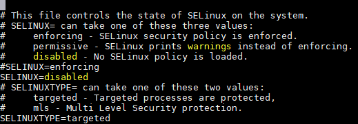
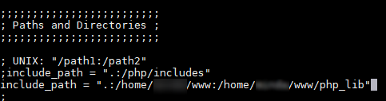

# CentOS 기준

## 1. CentOS 기본셋팅

인스턴스 생성 후 CentOS 6.X의 여러가지 설정등에 대해 설명한다.

### 1-1. 사양체크

리눅스 버전체크

```bash
uname -a
```

CentOS 버전체크

```bash
cat /etc/redhat-release
grep . /etc/*-release
```

하드용량 체크

```bash
df -h
```

메모리 체크

```bash
free -m
```

CPU 코어수 확인

```bash
cat /proc/cpuinfo | grep processor | wc -l
```

### 1-2. 시스템 시간 설정

별도의 사용자 생성 전까지는 ec2 생성시 부여받은 사용자가 아닌 root 계정으로 진행한다.

```bash
sudo -i
```

서울 리전에서 인스턴스를 생성했어도 서버시간이 UTC로 되어있으니 이를 Asia/Seoul/로 변경해준다.

```bash
vi /etc/sysconfig/clock
```


시스템 전체에 적용하기 위해 /usr/share/zoneinfo의 적절한 파일에 /etc/localtime을 심볼릭 링크한다.

```bash
ln -sf /usr/share/zoneinfo/Asia/Seoul /etc/localtime
```

잘 적용됬는지 시간 확인

```bash
date
```


> 추후 PHP 설치 이후 OS단 외에 Default timezone 설정이 필요하다

### 1-3. hostname 설정

\(추후 Route53 연결 후 작성\)

### 1-4. 개인 사용자 추가

사용자 추가

```bash
adduser domain
```

사용자 비밀번호 설정

```bash
passwd doamin
```

웹서버 사용을 위한 권한 설정

```bash
chmod 701 /home/domain
```

사용자 전환 후 웹 디렉토리 생성

```bash
su -l domain
mkdir www
exit
```

### 1-5. 방화벽 설정

CentOS 7 버전을 사용한다면 `firewall`을 추가 설치해서 사용해도 되지만 여기서는 6.X 버전대에서 사용가능한 `iptables` 를 사용하여 설정한다.

확인해보면 기본적으로 MarketPlace 에서 공식적으로 지원하는 AMI로 생성했을경우 기본적으로 온프레미스 환경에서 클린 설치한 CentOS와 같이 `iptables`와 `IPv6`체계에서 사용하는 `ip6tables`도 같이 설치되어 있는걸 확인할 수 있다.

```bash
rpm -qa | grep iptables
```


`CentOS`는 `Amazon Linux`, `Ubuntu` 와는 달리 기본적으로 SSH\(22\)포트만 허용이 된 상태이므로 AWS의 `Security Group` 에서 포트를 열어줬더라도 OS 단에서 추가적으로 80포트를 열여줘야 한다.

현재 열려있는 포트를 확인한다.

```bash
netstat -antl
```


80가 닫혀있는걸 확인 할 수 있다.

또한 서비스를 확인해보면 역시 기본적으로 작동하고 있음을 확인할 수 있다.

```bash
chkconfig --list
```

> `Security Group`에서 아무리 `Inbound`설정을 해줘도 80포트를 열어주거나 방화벽 서비스를 끄지 않으면 `ELB(Elastic Load Balancer)`를 통해 외부 접근 자체가 불가능해지니 해당 설정은 매우 중요하다.

`iptables`의 설정파일의 22번 포트 셋팅을 참고하여 하단에 80포트를 추가해준다.

```bash
vi /etc/sysconfig/iptables
```


> `iptables` **설정은 순서가 매우 중요하므로 추가적인 설정은 반드시 순서에 유념**

`table, chain, match, target, Connectio Tracking, commond` 설정은 상당이 다양하므로 여기서는 아주 간단한 규약만 명시한다.

```text
// 특정 IP 허용
-A INPUT -s ip 주소 -j ACCEPT

// 특정 IP 차단
-A INPUT -s ip 주소 -j DROP

// 특정 Port 허용
-A INPUT -p tcp –dport 443 -j ACCEPT

// 특정 Port 차단
-A INPUT -p tcp –dport 443 -j DROP
```

방화벽 설정을 끝냈다면 설정을 저장하고 방화벽을 재시작해준다.

```bash
service iptables save
service iptables restart
```

아래와 같이 나오면 정상이다.


설정이 제대로 되었는지 룰셋을 확인한다.

```bash
iptables -nL --line-numbers
```

## 2. 패키지 설치

`yum`을 통한 패키지 설치와 기본미러링으로 제공하지 않는 패키지를 설치한다.

### 2-1. 패키지 확인

`RedHat` 계열이므로 패키지 관리자 프로그램으로 `yum`을 사용한다.

일단 `yum`저장소 업데이트를 먼저 실행해서 패키지 목록을 갱신한다.

```bash
yum update
```

패키지가 어떤 버전대로 설치되는지 확인해본다.

```bash
yum list httpd
```

### 2-2. 패키지 설치

`PHP`를 제외한 필요한 패키지와 개발도구들을 설치한다.

> `PHP`를 yum 패키지로 설치하지 않는 이유는 configure 설정을 사용자화 하여 직접 컴파일하기 위해서 이며, 그렇게 하지 않을경우 `configure` 설정을 임의로 수정할 수 없다.

패키지 설치하기

```bash
yum groupinstall -y 'Development Tools' \
    && yum install -y gcc \
            make \
            vim \
            wget \
            tar \
            httpd-devel \
            libxml2-devel \
            bzip2-devel \
            openssl-devel \
            curl-devel \
            gd-devel \
            libc-client-devel \
            mysql55-devel \
            aspell-devel \
            libxslt-devel \
            epel-release \
            libmcrypt-devel \
            libmhash-devel \
            mysql-devel \
            yum-fastestmirror \
            netconfig \
            ntsysv \
            wget \
            tcpdump
```

> 명령어 구분자
>
> * `;` - 앞의 명령어가 실패해도 다음 명령어가 실행
> * `&&` - 앞의 명령어가 성공했을 때 다음 명령어가 실행
> * `&` - 앞의 명령어를 백그라운드로 돌리고 동시에 뒤의 명령어를 실행

가장 중요한 아파치가 잘 설치되었는지 확인해본다.

```bash
rpm -qa | grep http
```

## 3. 아파치 환경설정

Dns name 혹은 ip로 웹에서 접근하기 위한 작업과 웹 경로를 변경해주는 작업들을 한다.

### 3-1. 기본 설정

아파치 서비스 상태를 체크하고 꺼져있을 경우 부팅시 자동실행을 설정하고, 웹서버를 실행시킨 후 실제 웹에서 테스트 해본다.

```bash
chkconfig --list
chkconfig httpd on
service httpd start
```


현재까지의 설정과 `Aws Management Console`에서 해당 웹서버 혹은 `elb`의 `Security Group` Inboud 설정이 사내 IP 혹은 작업환경에서의 80 포트가 열려있다면 정상적으로 apache 화면이 떠야 한다.

만약안될 경우 서비스와 방화벽을 다시한번 체크한다.


### 3-2. 기본 경로 변경

일반적으로 보안이슈와 관리등 여러가지 사항으로 기본으로 설정되어 있는 `/var/html` 경로를 사용하진 않으므로 경로를 바꿔준다.

방법은 여러가지가 있지만 여기서는 아파치 설정파일\(httpd.conf\)에 추가 설정파일을 링크 시키고 모든 추가적인 설정은 추가 설정파일에 작성한다.

> CentOS는 같은 RedHat 계열이더라도 아파치 설정파일 경로와 가상서버를 `enable`시키는 방식이 다르니 참고

아파치 설정 파일을 연다

```bash
vi /etc/httpd/conf/httpd.conf
```

`virtualhost` 설정이 적혀있는 부분을 찾아서 `NameVirtualHost` 주석을 해제하고 가상호스트 설정파일의 경로를 추가해준다.

```markup
NameVirtualHost *:80
include /etc/httpd/conf/extra/httpd-vhosts.conf
```


include를 선언해준 경로에 폴더와 파일을 생성해주고 아래와 같이 입력한다.

```markup
<VirtualHost *:80>
    DocumentRoot /home/domain/www/public_html
    # Server* 부분은 추후 Roudte53 연결후 그에 맞게 작성해야 한다.
    ServerAdmin dev@test.com
    ServerName test.com
    ServerAlias www.test.com
    # Accec log와 error 로그를 사용자화여 지정
    ErrorLog logs/domain.com-error_log
    CustomLog logs/domain.com-access_log combined

    <Directory "/home/domain/www/public_html">
       #Options Indexes FollowSymLinks
       Options FollowSymLinks
       AllowOverride None
       Order allow,deny
       Allow from all
    </Directory>
</VirtualHost>
```

**주의사항**

> 1. `<Directory >` 부분을 웹에서 복사 붙여넣기 할경우 정상작동을 안하는 경우가 있다.
> 2. 해당 설정은 `Apache2.2` 버전에 해당하는 내용으로 2.4버전 이상은 설정값이 상이하다.
> 3. `FollowSymLinks` 의 `Indexes` 설정 삭제

설정파일을 수정했다면 문법검사를 실시해준다.

```bash
service httpd configtest
```


위와 같이 `Syntax OK`가 나온다면 정상이고 `Warning` 문구는 현재 `public_html`경로는 생성해주지 않았으니 추후 `git clone`을 해주면 문제 없지만 `PHP` 설치전 웹상에서 바뀐경로를 테스트 해보고 싶다면 임시로 `/home/domain/www`경로 아래에 `public_html` 폴더와 `index.html`파일을 생성해준다.

```bash
su -l domain
cd /home/domain/www
mkdir public_html
cd public_html
vi index.html
```

아파치를 재시작 해준다.

```bash
service httpd restart
```

### 3-3. 권한 설정

웹서버 경로의 권한과 그룹을 맞춰준다.

```bash
chmod  711  /home/domain
chmod  755  /home/domain/www
chown domain:apache /home/domain/www
```

### 3-4. selinux 설정

> 원래대로라면 여기까지 설정하면 가상호스트 경로의 파일\(예를 들면 index.html\)이 웹에서 보여야 하지만 실제로 접속해보면 권한 에러가 뜬다. [해당 이슈에 대한 참고 URL](https://stackoverflow.com/questions/17442370/you-dont-have-permission-to-access-on-this-server)

`CentOS` 는 `SELinux`라는 보안강화 모듈이 설치 및 활성화 되어있는데, 이로인해 웹에서 접근시 `permission error`가 뜨니 아래와 같이 조치한다. 기본적으로 웹 소프트웨어 업로드 및 파일 쓰기 기능을 막는 기능이라고 생각하면 된다.

```bash
setenforce 0
vi /etc/sysconfig/selinux
```

여기서 파일 중간의 `SELINUX`를 `disabled`로 변경해준다.



`Apache httpd`의 기본 `DocumentRoot`의 `SELinux security context` 확인

```bash
ls -alZ /var/www/html
```

새로 변경한 `DocumentRoot`의 `SELinux security context` 확인

```bash
ls -alZ /home/domain/www
#위에서 public_html/index.html 파일을 생성했을 경우 아래 커맨드로 확인
ls -alZ /home/domain/www/public_html/
```

현재 `SELinux` 상태 확인

```bash
sestatus
```

`/home/domain/www/public_html` 경로에 `index.html`파일이 존재한다면 웹에서 정상적으로 호출된다

만약 정상작동하지 않을경우 `httpd-vhost.conf`경로에 선언해준 `log` 를 확인해본다.

```bash
tail -f /etc/httpd/logs/domain.com-access_log
tail -f /etc/httpd/logs/domain.com-error_log
```

## 4. PHP 환경설정

앞서 설명한 것처럼 `PHP`는 직접 `configure`옵션을 주고 심볼릭 링크를 사용자화하여 설치 및 컴파일 하기 위해 `yum`패키지를 통한 설치가 아닌 외부 저장소에서 다운을 받아 직접 설치하는 방식으로 진행한다.

### 4-1. php 설치

`PHP`는 [php museum](http://museum.php.net/php5/)에서 다운로드 받는다.

> 처음 `yum`추가 패키지 설치시 `fastmirror`모듈도 설치했으므로 국내의 kakao 서버나 kaist 서버등에서 지원되는 패키지는 해당 서버에서 받아도 무방하다.

```bash
wget http://museum.php.net/php5/php-5.3.29.tar.gz
```

설치 후 삭제할 파일이므로 `/tmp` 경로에 압축을 풀어준다.

```bash
tar -zxvf php-5.3.29.tar.gz -C /tmp
```

원하는 경로에 압축이 풀렸는지 확인

```bash
[ ! -d /tmp/php-5.3.29 ] && echo 'not found'
```

++not found++ 문구가 안뜬다면 확인 완료

### 4-2. 심볼릭 링크 및 컴파일옵션 설정

64비트 운영체제에서는 특정 모듈 컴파일시 오류가 발생하니 하기 심볼릭 링크를 진행 해주고 설치를 해야한다.

```bash
ln -s /usr/lib64/libjpeg.so /usr/lib/libjpeg.so \
        && ln -s /usr/lib64/libXpm.so /usr/lib/libXpm.so \
        && ln -s /usr/lib64/mysql /usr/lib/mysql \
        && ln -s /usr/lib64/libpng.so /usr/lib/libpng.so \
        && yum install -y epel-release libmcrypt-devel libmhash-devel
```

### 4-3. php configure 옵션 설정 및 설치

`PHP`의 `configure`옵션을 설정해주고 컴파일 및 설치해준다.

```bash
cd /tmp/php-5.3.29 \
    && ./configure \
        --with-apxs2 \
        --with-config-file-path=/usr/local/lib/php \
        --with-config-file-scan-dir="/usr/local/lib/php/conf.d"\
        --disable-posix \
        --enable-bcmath \
        --enable-calendar \
        --enable-exif \
        --enable-fastcgi \
        --enable-ftp \
        --enable-gd-native-ttf \
        --enable-libxml \
        --enable-magic-quotes \
        --enable-mbstring \
        --enable-pdo \
        --enable-soap \
        --enable-sockets \
        --enable-wddx \
        --enable-zip \
        --enable-xdebug \
        --with-bz2 \
        --with-curl \
        --with-curlwrappers \
        --with-freetype-dir \
        --with-gd --with-gettext \
        --with-jpeg-dir \
        --with-kerberos \
        --with-libxml-dir \
        --with-libxml-dir \
        --with-mcrypt \
        --with-mhash \
        --with-mime-magic \
        --with-mysql \
        --with-mysqli \
        --with-openssl \
        --with-openssl-dir \
        --with-pcre-regex \
        --with-pdo-mysql \
        --with-pdo-sqlite \
        --with-pic \
        --with-png-dir \
        --with-pspell \
        --with-sqlite \
        --with-ttf \
        --with-xmlrpc \
        --with-xpm-dir \
        --with-xsl \
        --with-zlib \
        --with-zlib-dir \
    && make && make install \
    && cp /tmp/php-5.3.29/php.ini-production /usr/local/lib/php/php.ini
```

컴파일 및 설치가 완료 됬다면 다운받은 php 압축 파일등을 삭제한다.

```bash
rm -rf /tmp/php-5.3.29 && rm -rf {압축파일 다운로드받은 경로}/php-5.3.29.tar.gz
```

## 5. 추가설정 파일 셋팅

모든 셋팅이 끝난 후 기존 레거시 소스가 정상작동 하기 위한 `Apache`,`PHP` 등의 설정 파일을 현재 운영중인 서버를 참고하여 추가로 수정 및 작성한다.

### 5-1. 추가 아파치 설정\(httpd.conf\)

`httpd.conf`파일의 라인넘버를 참고하여 아래 코드를 추가해준다.

```markup
SetEnvIf Request_URI ".(ico|pdf|flv|jpg|jpeg|png|gif|js|css|gz|swf|txt|ico)$" dontlog
```


필요하다면 짧은 태그 허용\(short\_open\_tag\)를 허용해준다. \(보안이슈 문제가 있으니 선택적 사용이나 가급적 사용하지 않는걸 권장\)

```markup
short_open_tah = On
```


`mime`타입 관련 설정을 추가해 준다.

```markup
<IfModule mime_module>
    #
    # AddType allows you to add to or override the MIME configuration
    # file specified in TypesConfig for specific file types.
    #
    #AddType application/x-gzip .tgz
    AddType application/x-httpd-php .php .html .htm .phtml .inc
</IfModule>
```


### 5-2. PHP 설정\(php.ini\)

```bash
# php 컴파일 경로의 ini파일을 연다
vi /usr/local/lib/php/php.ini
```

`date.timezone` 부분을 찾아서 주석을 해제후 `Asia/Seoul`로 설정해준다.

```markup
date.timezone = Asia/Seoul
```


가비지 콜렉터 설정 `session.gc_divisor` 부분을 찾아서 100으로 수정해준다

```markup
session.gc_divisor
```


`session.bug_compat_42` 와 `session.bug_compat_warn` 부분을 찾아서 값을 아래와 같이 변경해준다. 해당 설정은 `register_globals`가 꺼져있음에도 불구하고 전역 영역에서 세션 변수를 초기화할 수 있는 버그를 사전경고 해준다.

```markup
session.bug_compat_42 = 1

session.bug_compat_warn = 1
```


`public_html`외부의 경로에서 사용하는 `php_lib` 접근을 위해 `php.ini`파일의 `Paths and Directories`부분을 찾아 `include_path`를 아래와 같이 지정해준다.

```bash
include_path = ".:/home/domain/www:/home/domain/www/php_lib"
```



`safe_mode`를 비활성화 해준다

```markup
safe_mode = Off
```


> php 6.0에서 제거

### 5-3. 환경변수 설정

PHP 비즈니스 로직에서 `getEnv`명령어로 불러오는 환경변수를 셋팅할 파일을 생성해준다

```bash
vi /etc/httpd/conf.d/env.conf
```

현재 사용하고 있는 환경변수를 셋팅해준다.

```markup
SetEnv DATABASE_CONNECTION rds
SetEnv SERVER_MODE dev
```

`DirectoryIndex`등의 추가적인 설정파일을 생성 및 셋팅해준다

```markup
AddHandler php5-script .php .html .htm
AddType text/html .php .html .htm
DirectoryIndex index.php index.html index.htm index.php3 index.inc
```


\(추후 xdebug 셋팅할시 추가 작성 필요\)

### 5-4. 기타 설정

```bash
git --version
```

`git`버전을 확인해보면 `1.7.1`버전이 깔려있다. 해당 버전은 `https protocol`을 처리 못하는 버그가 있고 `push,clone`등을 할때 `403 forbidden`에러가 발생한다. github 오피셜로 이 문제는 `1.7.1`버전문제로 다른 버전을 설치하는 것 외엔 방법이 없다고 하니 최소 1.7.4 이상을 받아야 한다.

일단 기존에 설치되어 있는 `git`을 삭제한다.

```bash
yum remove git
```

2.X 이상을 설치할 경우엔 `Wandisco`사의 `repository`를 설치한 후 yum 패키지로 설치를 하면 된다.

> [Wandisco - centos 저장서](http://opensource.wandisco.com/centos/6/git/x86_64/)

```bash
rpm -Uvh http://opensource.wandisco.com/centos/6/git/x86_64/wandisco-git-release-6-1.noarch.rpm
```

`repository`가 설치 됬으면 2.X 대의 `git`을 설치해준다.

```bash
yum --enablerepo=WANdisco-git --disablerepo=base,updates install git
```

버전을 확인해본다

```bash
git --version
```

## 6. AWS 작업환경 셋팅

aws cli를 비롯한 sdk 설치 및 설정

### 6-1. Python & pip 설치

로컬 환경 외에도 `EC2`에 올라가있는 `Linux OS` 에서도 `AWS CLI` 설치는 여러가지 면에서 필수적이다.

다만 `Aws cli`자체가 `python` 패키지 관리자인 `pip`로 관리되고 있으며, 원활한 `pip`설치를 위해서는 최소한 `python 2.7` 이상의 버전이 필요하다

`CentOS`에는 기본 python 버전이 `2.6` 이하 이므로 `pyhton`부터 재설치가 필요하다 지원이 끊긴지 오래된 OS 인만큼 당연히 기본 yum 저장소엔 파이썬 2.X 버전조차도 없으니 저장소를 추가해준후 `RPM`설치를 하거나 공식 홈페이지에서 `tgz`압축 파일을 직접 다운받아 `PHP`와 동일한 방식으로 직접 `make install`까지 해줘야 한다.

**Python3.6.X 설치**

```bash
#다운받을 위치
cd /usr/src

#공식홈에서 파이썬 압축파일 다운로드
wget https://www.python.org/ftp/python/3.6.4/Python-3.6.4.tgz
tar xzf Python-3.6.4.tgz

cd Python-3.6.4

./configure --enable-optimizations
make altinstall

#압축파일 삭제
rm /usr/src/Python-3.6.4.tgz

#심볼릭링크 설정
ln -s /usr/src/Python-3.6.4/python /bin/python3
```

**pip설치**

최신버전의 `pip`와 `setuptools`라는 다른 필수 패키지를 다운로드하고 설치한다.

```bash
curl -O https://bootstrap.pypa.io/get-pip.py
```

파이썬으로 스크립트를 실행한다.

```bash
python3 get-pip.py --user
```

> `python3(3.X)`으로 설치하지 않고 `python(2.X)`으로 설치할 경우 정상 작동하지 않으니 주의

실행경로를 `PATH` 변수에 추가한다.

```bash
#내보내기 명령을 프로필 스크립트에 추가
export PATH=~/.local/bin:$PATH

#프로필을 현재 세션에 로드(root 기준)
source ~/.bash_profile

#pip 버전 확인
pip --version
```

> 맥이나 기타 사용하는 쉘이 있을경우 거기에 맞게 설정해주면 된다
>
> * Bash : .bash\_profile, .profile 또는 .bash\_login
> * Zsh : .zshrc
> * Tcsh : .tcshrc, .cshrc 또는 .login

### 6-2. Aws cli 설치

`pip`를 사용해서 `AWS CLI`를 설치한다

```bash
pip install awscli --upgrade --user

#aws cli 버전확인
aws --version
```

추후 `AWS CLI`를 최신 버전으로 업그레이드 하려면 설치명령을 다시 실행하면 된다

```bash
pip install awscli --upgrade --user
```

### 6-3. 기타

[\[공식\]AWS 볼륨크기 조정 가이드 문서](https://docs.aws.amazon.com/ko_kr/AWSEC2/latest/UserGuide/recognize-expanded-volume-linux.html)

EBS 용량이 기본제공을 초과하거나\(8GB\) `Attach`할경우 불륨 확장 작업이 필요하다

> 예를 들면 인스턴스 생성시 `100GB`로 설정을 하더라도 실제로 `df -h` 커맨드로 확인해보면 가용용량은 `8GB`로 되어있다.

연결된 블록디바이스 목록을 조회한다.

```bash
lsblk
```

아마존 공식문서에는 파티션 확장 커맨드를 바로 명시하지만 실제로는 추가 패키지로 설치를 해야한다

```bash
yum install cloud-utils-growpart

growpart /dev/xvda 1 << 이부분은 lsblk로 확인한 볼륨 명을 적어준다.

#확인
lsblk
```

인스턴스를 재부팅한다.

## 7. CloudWatch logs Agent 셋팅

CloudWatch logs Agent 설치 및 구성

### 7-1. CloudWatch Logs 설치 및 구성

```bash
# 임시다운로드 경로로 이동
cd /usr/src

# agent 다운로드
curl https://s3.amazonaws.com/aws-cloudwatch/downloads/latest/awslogs-agent-setup.py -O
curl https://s3.amazonaws.com/aws-cloudwatch/downloads/latest/AgentDependencies.tar.gz -O

# AgentDependencies 압축 해제
tar xvf AgentDependencies.tar.gz -C /tmp/

# python 버전과 리전지정에 주의
# python 2.6 ~ 3.5 버전만 지원
# 서울리전 endpoint = ap-northeast-2
python ./awslogs-agent-setup.py --region ap-northeast-2 --dependency-path /tmp/AgentDependencies
```

이후 환경설정을 [AWS 가이드 문서](https://docs.aws.amazon.com/AmazonCloudWatch/latest/logs/QuickStartEC2Instance.html)를 참조하여 작성한다.


