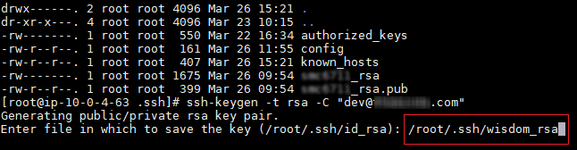
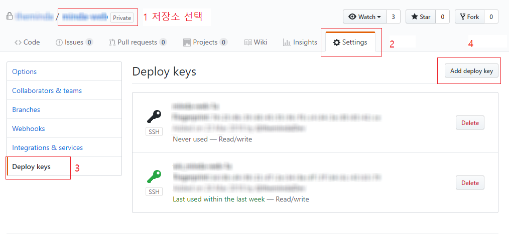

# Migrations

## TOC

* **1. 소스이관**
  * **1-1. EC2에서 git 설정**
  * **1-2. deploy key 설정**
  * **1-3. Git 저장소에서 소스 가져오기**
* **2. DB 데이터 이관**
  * **2-1. 기존 DB에서 RDS로 데이터 이관**
  * **2-2. RDS Character set 설정**
  * **2-3. 기존 DB에서 function 이관**

## 1. 소스이관

`git hub`저장소에 올라가 있는 소스를 ec2 웹서버로 이관한다.

### 1-1. EC2 에서 git 설정

[CentOS 셋팅](https://docs.devvisdom.com/environment/aws/os/centos#5-4)문서의 `git` 설치 항목을 참고하여 ec2 웹서버에 `1.7.4` 버전 이상의 `git`이 설치되어 있다는 가정하에 진행한다.

### 1-2. deploy key 설정

편의상 `root` 계정으로 `~/.ssh`에 각 계정별\(개발자\) `ssh`키를 생성한 후 `Git` 원격저장소\(`Github`, `CodeCommit`등\) 에 등록해준다.

`ssh`키를 생성할 경로는 `home/{user}/.ssh` 가 아닌 `root`의 `~/.ssh` 루트로 설정해야 `ssh`등록이 가능하다.

```bash
#root 계정으로 전환
sudo -i
#각자의 github 계정정보로 ssh-key 생성
ssh-keygen -t rsa -C "username@email.com"
```

위와 같이 `ssh`키를 생성할경우 저장할 경로를 묻는데, 편의상 각 사용자의 계정을 따서 `ssh`키를 만든다.

> 예\) wisdom\_rsa



위와 같이 뜨면 `/root/.ssh/{username}_rsa`형식으로 지정해주고 키를 생성한다 **\(기존 파일에 덮어씌어지지 않도록 경로지정 및 파일명 지정 필수\)**

이후 생성된 파일중 공개키\(`username_rsa.pub`\)를 복사하여

```bash
cat username_rsa.pub
```

github 저장소의 `Setting` -&gt; `Deploy keys` 에 등록해준다.



### 1-3. Git 저장소에서 소스 가져오기

`Document` 경로로 이동한 후 원격 저장소의 소스를 `clone`한다.

> 기존에 테스트 용도로 생성되어 있는 `www`경로가 존재할 경우 삭제한 후 `git`저장소 `clone`시 폴더명을 `www`로 명시하여 진행한다.

```bash
cd /home/{user}
rm -rf www #www 폴더가 존재할 경우만
git clone git@github.com:{user}/sample-web.git www
```

```bash
cd /home/{user}
rm -rf www #www 폴더가 존재할 경우만
git clone git@github.com:{user}/sample-web.git www
```

```bash
cd /home/{user}
rm -rf www #www 폴더가 존재할 경우만
git clone git@github.com:{user}/sample-web.git www
```

```bash
cd /home/{user}
rm -rf www #www 폴더가 존재할 경우만
git clone git@github.com:{user}/sample-web.git www
```

```bash
cd /home/{user}
rm -rf www #www 폴더가 존재할 경우만
git clone git@github.com:{user}/sample-web.git www
```

```bash
cd /home/{user}
rm -rf www #www 폴더가 존재할 경우만
git clone git@github.com:{user}/sample-web.git www
```

```bash
cd /home/{user}
rm -rf www #www 폴더가 존재할 경우만
git clone git@github.com:{user}/sample-web.git www
```

```bash
cd /home/{user}
rm -rf www #www 폴더가 존재할 경우만
git clone git@github.com:{user}/sample-web.git www
```

```bash
cd /home/{user}
rm -rf www #www 폴더가 존재할 경우만
git clone git@github.com:{user}/sample-web.git www
```

```bash
cd /home/{user}
rm -rf www #www 폴더가 존재할 경우만
git clone git@github.com:{user}/sample-web.git www
```

```bash
cd /home/{user}
rm -rf www #www 폴더가 존재할 경우만
git clone git@github.com:{user}/sample-web.git www
```

```bash
cd /home/{user}
rm -rf www #www 폴더가 존재할 경우만
git clone git@github.com:{user}/sample-web.git www
```

```bash
cd /home/{user}
rm -rf www #www 폴더가 존재할 경우만
git clone git@github.com:{user}/sample-web.git www
```

```bash
cd /home/{user}
rm -rf www #www 폴더가 존재할 경우만
git clone git@github.com:{user}/sample-web.git www
```

```bash
cd /home/{user}
rm -rf www #www 폴더가 존재할 경우만
git clone git@github.com:{user}/sample-web.git www
```

```bash
cd /home/{user}
rm -rf www #www 폴더가 존재할 경우만
git clone git@github.com:{user}/sample-web.git www
```

```bash
cd /home/{user}
rm -rf www #www 폴더가 존재할 경우만
git clone git@github.com:{user}/sample-web.git www
```

```bash
cd /home/{user}
rm -rf www #www 폴더가 존재할 경우만
git clone git@github.com:{user}/sample-web.git www
```

```bash
cd /home/{user}
rm -rf www #www 폴더가 존재할 경우만
git clone git@github.com:{user}/sample-web.git www
```

```bash
cd /home/{user}
rm -rf www #www 폴더가 존재할 경우만
git clone git@github.com:{user}/sample-web.git www
```

```bash
cd /home/{user}
rm -rf www #www 폴더가 존재할 경우만
git clone git@github.com:{user}/sample-web.git www
```

```bash
cd /home/{user}
rm -rf www #www 폴더가 존재할 경우만
git clone git@github.com:{user}/sample-web.git www
```

```bash
cd /home/{user}
rm -rf www #www 폴더가 존재할 경우만
git clone git@github.com:{user}/sample-web.git www
```

```bash
cd /home/{user}
rm -rf www #www 폴더가 존재할 경우만
git clone git@github.com:{user}/sample-web.git www
```

```bash
cd /home/{user}
rm -rf www #www 폴더가 존재할 경우만
git clone git@github.com:{user}/sample-web.git www
```

```bash
cd /home/{user}
rm -rf www #www 폴더가 존재할 경우만
git clone git@github.com:{user}/sample-web.git www
```

```bash
cd /home/{user}
rm -rf www #www 폴더가 존재할 경우만
git clone git@github.com:{user}/sample-web.git www
```

```bash
cd /home/{user}
rm -rf www #www 폴더가 존재할 경우만
git clone git@github.com:{user}/sample-web.git www
```

```bash
cd /home/{user}
rm -rf www #www 폴더가 존재할 경우만
git clone git@github.com:{user}/sample-web.git www
```

```bash
cd /home/{user}
rm -rf www #www 폴더가 존재할 경우만
git clone git@github.com:{user}/sample-web.git www
```

```bash
cd /home/{user}
rm -rf www #www 폴더가 존재할 경우만
git clone git@github.com:{user}/sample-web.git www
```

```bash
cd /home/{user}
rm -rf www #www 폴더가 존재할 경우만
git clone git@github.com:{user}/sample-web.git www
```

```bash
cd /home/{user}
rm -rf www #www 폴더가 존재할 경우만
git clone git@github.com:{user}/sample-web.git www
```

```bash
cd /home/{user}
rm -rf www #www 폴더가 존재할 경우만
git clone git@github.com:{user}/sample-web.git www
```

```bash
cd /home/{user}
rm -rf www #www 폴더가 존재할 경우만
git clone git@github.com:{user}/sample-web.git www
```

```bash
cd /home/{user}
rm -rf www #www 폴더가 존재할 경우만
git clone git@github.com:{user}/sample-web.git www
```

```bash
cd /home/{user}
rm -rf www #www 폴더가 존재할 경우만
git clone git@github.com:{user}/sample-web.git www
```

```bash
cd /home/{user}
rm -rf www #www 폴더가 존재할 경우만
git clone git@github.com:{user}/sample-web.git www
```

```bash
cd /home/{user}
rm -rf www #www 폴더가 존재할 경우만
git clone git@github.com:{user}/sample-web.git www
```

```bash
cd /home/{user}
rm -rf www #www 폴더가 존재할 경우만
git clone git@github.com:{user}/sample-web.git www
```

```bash
cd /home/{user}
rm -rf www #www 폴더가 존재할 경우만
git clone git@github.com:{user}/sample-web.git www
```

```bash
cd /home/{user}
rm -rf www #www 폴더가 존재할 경우만
git clone git@github.com:{user}/sample-web.git www
```

```bash
cd /home/{user}
rm -rf www #www 폴더가 존재할 경우만
git clone git@github.com:{user}/sample-web.git www
```

```bash
cd /home/{user}
rm -rf www #www 폴더가 존재할 경우만
git clone git@github.com:{user}/sample-web.git www
```

```bash
cd /home/{user}
rm -rf www #www 폴더가 존재할 경우만
git clone git@github.com:{user}/sample-web.git www
```

```bash
cd /home/{user}
rm -rf www #www 폴더가 존재할 경우만
git clone git@github.com:{user}/sample-web.git www
```

```bash
cd /home/{user}
rm -rf www #www 폴더가 존재할 경우만
git clone git@github.com:{user}/sample-web.git www
```

```bash
cd /home/{user}
rm -rf www #www 폴더가 존재할 경우만
git clone git@github.com:{user}/sample-web.git www
```

