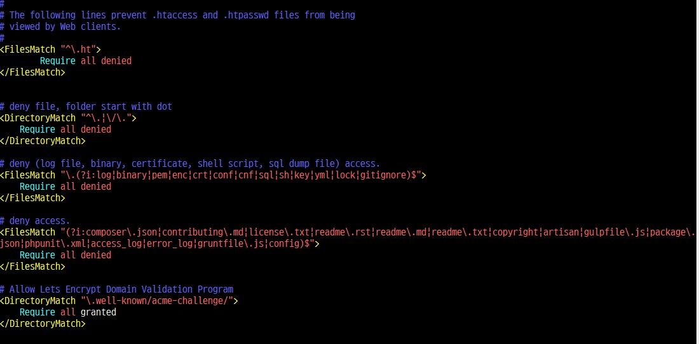
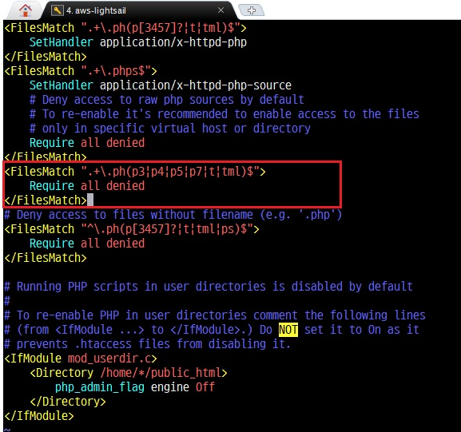
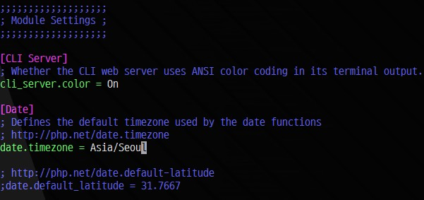
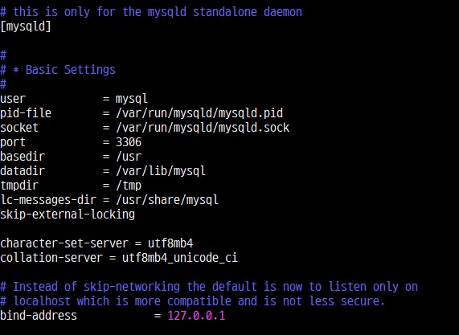

# Simple APM

`Ubuntu`에 가장 기본적인 개발환경셋팅하기

테스트 환경및 구성할 내용은 아래 리스트와 같다.

* AWS LightSail 
  * 512MB RAM, 1vCPU, 20GB SSD
  * 서울리전
  * ap-northeast-2a
* Ubuntu 16.04 LTS
* apache 2.4
* PHP 7.X
* MariaDB

## 1. OS & basic info check

```bash
# 리눅스 버전 체크uname -a# Ubuntu 버전 체크cat /etc/issue# 더 자세한 Ubuntu 버전 체크lsb_release -a# 하드용량체크 df -h# 메모리 체크free -m# CPU 코어수 체크cat /proc/cpuinfo | grep processor | wc -lcat /proc/cpuinfo | grep processor# 자세한 CPU 제원 체크cat /proc/cpuinfo
```

## 2. Basic Settings


편의상 `sudo` 명령어는 따로 기술하지 않음


```bash
# root권한으로 변경sudo su# 사용자 확인 - 콘솔상에서도 명시적으로 확인할수 있다whoaimi# 패키지 목록 갱신apt-get update# 설치되어있는 프로그램 최신버전으로 설치apt-get upgrade# 시스템 시간 설정# 입력시 GUI 환경이 나올면 Asia->Seoul 순으로 선택해주면 된다.dpkg-reconfigure tzdata# hostname 설정 - lightsail 상의 ip로 입력되어 있다. # 보통은 해당 서버에 연결할 도메인명으로 설정vi /etc/hostname# 변경한 hostname 적용 - 재접속해야 적용됨hostname -F /etc/hostname
```

## 3. Apache2

### 3-1. 설치

```bash
# apache2 설치apt-get install apache2# version Check - 적성일 기준  Apache/2.4.18 설치apache2 -v
```

이 시점에서 도메인을 입력했을때 apache2 기본화면이 나와야 하며, 그 경로는 `var/www/html/index.html` 이다.


물론 서버셋팅과는 별도로 lightsail 혹은 그외의 서비스에서 DNS 셋팅과 도메인연결을 해야 한다.


### 3-2. 모듈 활성/비활성화

```bash
a2enmod rewritea2enmod headersa2enmod ssla2dismod -f autoindex# ...추가예정
```

### 3-3. Web access 되면 안될 파일들 접근제어

```bash
# apache 설정파일 열기vi /etc/apache2/apache2.conf
```

중간에 `<FilesMatch “^\.ht”>` 구문 다음에 아래 코드를 추가한다.

```markup
# deny file, folder start with dot<DirectoryMatch "^\.|\/\.">    Require all denied</DirectoryMatch># deny (log file, binary, certificate, shell script, sql dump file) access.<FilesMatch "\.(?i:log|binary|pem|enc|crt|conf|cnf|sql|sh|key|yml|lock|gitignore)$">    Require all denied</FilesMatch># deny access.<FilesMatch "(?i:composer\.json|contributing\.md|license\.txt|readme\.rst|readme\.md|readme\.txt|copyright|artisan|gulpfile\.js|package\.json|phpunit\.xml|access_log|error_log|gruntfile\.js|config)$">    Require all denied</FilesMatch># Allow Lets Encrypt Domain Validation Program<DirectoryMatch "\.well-known/acme-challenge/">    Require all granted</DirectoryMatch>
```



### 3-4. 추가 보안 설정

기본 언어셋이 주석처리 되어 있으니 이를 찾아서 해제해준다.

```bash
vi /etc/apache2/conf-available/charset.conf
```

그외 권장 보안설정으로 제작자가 작성해놓은 부분을 주석만 해제한다. 활성화된 옵션은 하기와 같다.

```markup
# 나중에 명시적으로 허용되는 디렉토리를 제외하고 전체 파일시스템에 대한 액세스를 비활성화 한다<Directory />   AllowOverride None   Require all denied</Directory># HTTP 응답으로 반환하는 내용을 구성한다.# 기본값은 `Full`이며 OS 유형에 대한 정보를 보내고 모듈로 컴파일된다.# FUll | OS | Minimal | Minor | Major | Prod# 오르쪽으로 갈수록 보여주는 정보량이 적다 (외부에 궂이 서버정보를 보여줄 이유도 필요도 없으니 테스트 서버라도 Prod) ServerTokens Prod# 선택적으로 서버 버전 및 가상 호스트 이름을 포함하는 행을 서버 생성 페이지 # (내부 오류 문서, FTP 디렉토리 목록, mod_status 및 mod_info 출력 등) 에 추가해라# (CGI 생성 문서 또는 사용자 정의 오류 문서는 제외).# 사용가능 옵션중에 EMail은 ServerAdmin 에 mailto 링크를 포함시키고 싶을경우 사용한다.# ServerTokens과 같은 이유로 끄자ServerSignature Off# TRACE method 허용# 요청 본문을 반영하려면 `extended`로 설정 (오직 테스트와 진단 목적으로만 )TraceEnable Off# 이 헤더를 설정하면 MSIE가 파일을 HTTP 헤더의 내용 유형에 의해 선언 된 것 외에는 # 다른 무언가(something)로 해석하지 못한다.# mod_headers를 활성화 해야 한다.Header set X-Content-Type-Options: "nosniff"# 이 헤더를 설정하면 다른 사이트가 이 사이트의 페이지를 퍼갈 수 없다.# clickjacking 공격을 방어한다.# mod_headers를 활성화 해야 한다.Header set X-Frame-Options: "sameorigin"
```

```bash
# 변경한 설정 적용service apache2 reload
```

## 4. PHP

### 4-1. PHP & module 설치

```bash
# php 설치 - 작성일 기준 PHP 7.0.30 버전 설치됨apt-get install php# 필요한 모듈들 설치apt-get install {모듈명}# PHP-Apache 연동 모듈apt-get install libapache2-mod-php7.0# db연동모듈 설치apt-get install php-mysql# 암호화 모듈apt-get install php-mcrypt# 다국어 처리 모듈apt-get install php-mbstring# 이미지 처리 모듈apt-get install php-gd
```


추가로 설치할 모듈은 아래 커맨드로 검색후 설치한다.


```bash
apt-cache search php-
```

### 4-2. PHP 권한설정 \(Optional\)

`shell`의 권한과 `sftp`, `web`의 권한을 동일하게 셋팅 \(보안상\)

```bash
# 패키지 확인apt-cache search mpm-itk# 설치apt-get install libapache2-mpm-itk# 권한 변경chmod 711 /homechmod -R 700 /home/*
```

### 4-3. PHP 확장자 제한 \(Optional\)

php를 해성하는 확장자를 제한해준다.

```bash
vi /etc/apache2/mods-available/php7.0.conf
```


libapache2-mod-php7.0 모듈을 설치해야 위 설정파일이 존재한다.


`.php` 확장자만 접근 가능하도록 추가해준다



```bash
# 적용service apache2 restart
```

### 4-4. PHP default timezone 설정 \(Optional\)

설정 안할경우 시스템 timezone을 사용한다.

사용용도에 따라 각각 참조하는 timezone이 다르니 둘다 설정해준다.

```bash
# apache - php 에서 참조하는 파일vi /etc/php/7.0/apache2/php.ini# Cron or console 에서 참조하는 파일vi /etc/php/7.0/cli/php.ini
```

각각 `date.timezone`을 찾아 주석을 해제하고 `Asia/Seoul` 로 적어준다.



```bash
적용service apache2 restart
```

php파일에서 `phpinfo();`로 `Default timezone`이 `Asia/Seoul`로 되어있으면 정상적으로 적용완료

## 5. MariaDB 설치

```bash
# MariaDB 설치 - 작성일 기준 MariaDB 10.0.36 버전 설치됨apt-get install mariadb-server
```

### 5-1. MariaDB 초기화

아래 명령어로 DB 초기화 작업을 진행한다. \(패스워드 설정등..\) 설정이 잘못된거 같으면 다시한번 실행하면 된다.

```bash
/usr/bin/mysql_secure_installation
```

### 5-2. root 인증 플러그인 교체 \(Optional\)

현재 설정값은 서버사이드 인증으로 비밀번호 필요없이 쉘인증을 한다 기본값으로 root 사용자가 `unix_socket Auth Plugin` 설정되어 있다.

즉, `root`계정인 경우 아래 커맨드만 입력해도 바로 DB에 접근가능하다

```bash
mysql
```

이걸 기존처럼 비밀번호 인증방식으로 변경한다

```sql
use mysql;update user set plugin='' where User='root';flush privileges;
```

### 5-3. 기본 언어셋 변경

언어셋 설정 안해주면 `latin1`로 생성되니 이를 변경해준다.

```bash
vi /etc/mysql/mariadb.conf.d/50-server.cnf
```

`[mysqld]` 항목에 아래 두줄 추가

```markup
character-set-server = utf8mb4collation-server = utf8mb4_unicode_ci
```



변경사항 적용

```bash
service mysql restart
```

## 6. 웹 환경을 위한 설정

### 6-1. 사용할 계정 셋팅

```bash
# user 생성adduser {Username}# user 삭제userdel -r {Username}# 사용자 변경 - 사용자 홈루트로 접근됨 `/home/{Username}`su -l {Username}# 웹루트를 위한 폴더 생성mkdir www# 계졍 나가기exit
```

### 6-2. Apache 환경설정파일 작성

생성한 계정과 도메인명을 기준으로 작성한다.

```markup
<VirtualHost *:80>    ServerName example.com    ServerAlias www.example.com    DocumentRoot /home/username/www    <Directory /home/username/www>        Options FollowSymLinks MultiViews        AllowOverride All        require all granted    </Directory>    AssignUserID username username    ErrorLog ${APACHE_LOG_DIR}/username.com-error.log    CustomLog ${APACHE_LOG_DIR}/username.com-access.log combined</VirtualHost>
```

사이트를 활성화 한다.

```bash
# 사이트 활성화a2ensite confFileName# 비활성화a2dissite confFileNameservice apache2 reload
```

