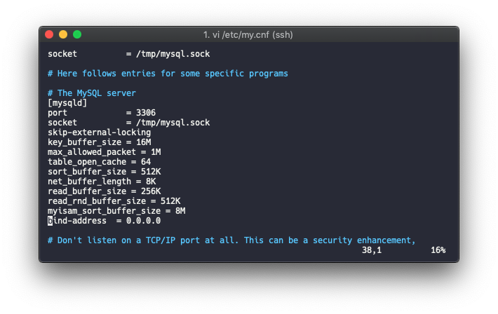
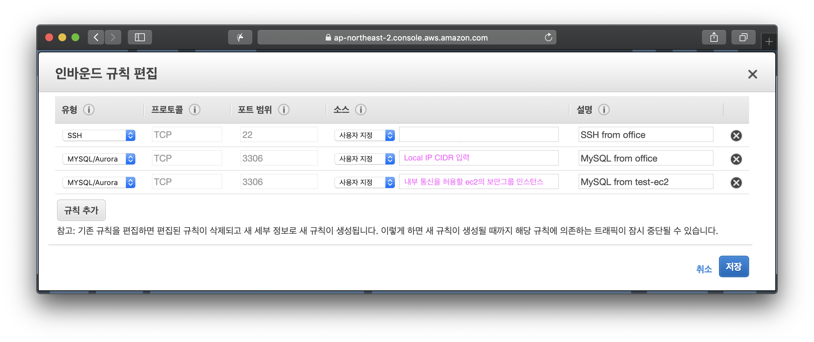

# Simple MySQL

`Ubuntu 16.04`에서 기본적으로 제공하는 `MySQL`은 5.7 버전이므로 그 외 버전이 필요할 경우 `apt`를 통해 설치하지 않고 직접 다운로드 받아서 진행한다.

> 5.7 보다 상위버전일 경우 apt 저장소에 필요한 패키지 저장소를 추가하여 apt를 통해 설치 가능하다

## 1. MySQL 5.5 install

### 1. 설치사양

* Ubuntu.16.04 LTS
* MySQL 5.5 

`https://dev.mysql.com`에서 직접 다운받아 설치한다.

### 2. 설치

```bash
# root 계정으로 진행

# mysql 유저와 그룹생성
groupadd mysql
useradd -g  mysql mysql

# 5.5 버전 다운로드 및 압축해제
cd /root

wget https://dev.mysql.com/get/Downloads/MySQL-5.5/mysql-5.5.56-linux-glibc2.5-x86_64.tar.gz
tar -xvf mysql-5.5.56-linux-glibc2.5-x86_64.tar.gz /usr/local

cd /usr/local

mv mysql-5.5.56-linux-glibc2.5-x86_64 mysql

# mysql 그룹/유저 설정
cd mysql
chown -R mysql:mysql *

# 필요한 lib 패키지 설치
apt install libaio1

# install script 실행
scripts/mysql_install_db --user=mysql

chown -R root .
chown -R mysql data

cp support-files/my-medium.cnf /etc/my.cnf 

# Start Mysql
bin/mysqld_safe --user=mysql &
cp support-files/mysql.server /etc/init.d/mysql.server

# root 패스워드 설정
bin/mysqladmin -u root password '1234'

# Start mysql seerver
/etc/init.d/mysql.server start

# Stop mysql server
/etc/init.d/mysql.server stop

# Check status of mysql
/etc/init.d/mysql.server status

#Enable myql on startup
update-rc.d -f mysql.server defaults 

#Disable mysql on startup
update-rc.d -f mysql.server remove

# 심볼릭 링크
ln -s /usr/local/mysql/bin/mysql /usr/local/bin/mysql

# 접속
mysql -uroot -p1234
```

### 3. 외부 접속 허용

```bash
vi /etc/my.cnf
```

`my.cnf`파일에 `bind-address = 0.0.0.0` 추가 \( 이미 있다면 변경 \)



EC2에 SSH로 mysql에 접속해서 외부 접속할 계정 권한 설정

```text
grant all privileges on *.* to root@'%' identified by '1234';
```

이제 local 환경에서 DB클라이언트로 공인아이피를 통해 Mysql 접속 가능하며 주의할 점은 local이 아닌 AWS EC2 서버간 통신을 위해 보안그룹에 local과 통신할 EC2의 보안그룹 두개를 열어준다. \(SSH는 mysql ec2에 접속하여 작업할 경우를 위한 inbound\)

> mysql ec2의 보안그룹 참조



