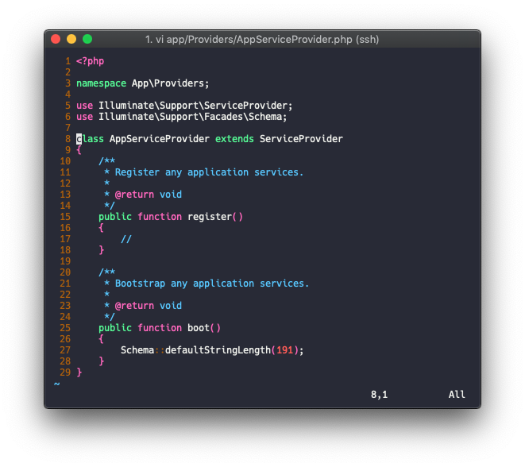

# Simple Nginx/php

## 1. OS & basic info check

```bash
# 리눅스 버전 체크
uname -a

# Ubuntu 버전 체크
cat /etc/issue

# 더 자세한 Ubuntu 버전 체크
lsb_release -a

# 하드용량체크 
df -h

# 메모리 체크
free -m

# 디테일한 메모리 체크
vmstat -s

# CPU 코어수 체크
cat /proc/cpuinfo | grep processor | wc -lcat /proc/cpuinfo | grep processor

# 자세한 CPU 제원 체크
cat /proc/cpuinfo
```

## 2. Basic Settings

```bash
#패키지  목록 업데이트
apt update

# 설치된 프로그램 최신버전 설치
apt upgrade

# 시스템 시간 설정 ( Asia - Seoul 순으로 선택)
dpkg-reconfigure tzdata
```

## 3. Package Repository

```bash
# 최신 버전 등록
vi /etc/apt/sources.list
```

아래 코드를 맨아래 추가

```bash
# Nginx
deb http://nginx.org/packages/mainline/ubuntu/ xenial nginx
deb-src http://nginx.org/packages/mainline/ubuntu/ xenial nginx
```


nginx 보안키 다운로드 및 적용

```bash
cd /root
wget http://nginx.org/keys/nginx_signing.key
apt-key add nginx_signing.key
rm nginx_signing.key
```


`apt-cache search php7`를 사용해서 검색시 OS에서 기본적으로 지원하는 PHP버전\(보통은 최신버전\)을 설치해도 무방할경우 `apt install php-{VERSION}`을 통해 설치하면된다.

만약 기본 저장소 외의 버전을 설치하고 싶을 경우 패키지 저장소를 추가해서 설치를 진행한다.

**PPA 개인패키지 저장소를 사용하여 php-7.X 버전 설치**


Ubuntu 제작자중 한명이며 Debian에서 일하고 있는 ondrej 저장소를 이용


```bash
apt-get install software-properties-commonadd-apt-repository ppa:ondrej/php

# 추가된 보안키 목록 확인
apt-key list

# 추가된 저장소 갱신
apt update
```

## 4. Package Install

### Nginx

```text
apt install nginx

service nginx restart
```

여기까지 했을때 Public Ip 로 접근시 아래와 같은 화면이 떠야한다.

> 파일 위치는 /usr/share/nginx/html/index.html


### PHP-FPM

```bash
# 원하는 버전 검색
apt search php

apt install php7.2-fpm
```

`PHP`와 `PHP-FPM` 버전 확인

```text
php -v
php-fpm7.2 -v
```


일반적인 PHP 모듈들과 라라벨에서 필요로하는 모듈등 설치

```bash
apt install -y php7.2-cli \
php7.2-common \
php7.2-curl \
php7.2-json \
php7.2-xml \
php7.2-gd \
php7.2-mbstring \
php7.2-mysql \
php7.2-bcmath \
php7.2-dev openssl \
php7.2-zip
```

PHP Default timezone 설정

```bash
vi /etc/php/7.2/fpm/php.ini

vi /etc/php/7.2/cli/php.ini
```

두개의 파일 모두 `date.timezone`을 찾아서 주석해제후 아래와 같이 원하는 timezone 입력


```text
service php7.2-fpm restart
```

### Nginx와 PHP-FPM설정

**Nginx 사용자 권한 변경**

```bash
vi /etc/nginx/nginx.conf
```

아래 이미지에서 2번째 라인 user값을 `www-data`로 변경한다


```bash
service nginx restart
```

**Nginx에서 PHP 확장자를 FPM으로 요청하도록 설정**

```bash
vi /etc/nginx/conf.d/default.conf
```

> `default.conf` 파일을 아리 기본구문으로 변경 \(기존데이터는 백업\)

```markup
server {    
    listen 80 default_server;    
    server_name  localhost;
    root /var/www/public;

    location / {        
        index  index.php index.html;        
        try_files $uri $uri/ /index.php?$args;    
    }    

    # Allow Lets Encrypt Domain Validation Program    
    location ^~ /.well-known/acme-challenge/ {        
        allow all;    
    }    

    # Block dot file (.htaccess .htpasswd .svn .git .env and so on.)    
    location ~ /\. {        
        deny all;    
    }

    # Block (log file, binary, certificate, shell script, sql dump file) access.    
    location ~* \.(log|binary|pem|enc|crt|conf|cnf|sql|sh|key)$ {        
        deny all;    
    }

    # Block access    
    location ~* (composer\.json|contributing\.md|license\.txt|readme\.rst|readme\.md|readme\.txt|copyright|artisan|gulpfile\.js|package\.json|phpunit\.xml)$ {        
        deny all;    
    }

    location ~ [^/]\.php(/|$) {        
        fastcgi_split_path_info ^(.+?\.php)(/.*)$;        
        if (!-f $document_root$fastcgi_script_name) {            
            return 404;        
        }        
        fastcgi_pass unix:/run/php/php7.4-fpm.sock;
        fastcgi_index index.php;        
        include fastcgi_params;    
    }
}
```

**fastcgi\_params 변경**

```bash
vi /etc/nginx/fastcgi_params
```

> `fastcgi_params` 파일을 변경

```text
fastcgi_param   QUERY_STRING            $query_string;
fastcgi_param   REQUEST_METHOD          $request_method;
fastcgi_param   CONTENT_TYPE            $content_type;
fastcgi_param   CONTENT_LENGTH          $content_length;

fastcgi_param   SCRIPT_FILENAME         $document_root$fastcgi_script_name;
fastcgi_param   SCRIPT_NAME             $fastcgi_script_name;
fastcgi_param   PATH_INFO               $fastcgi_path_info;
fastcgi_param   PATH_TRANSLATED         $document_root$fastcgi_path_info;
fastcgi_param   REQUEST_URI             $request_uri;
fastcgi_param   DOCUMENT_URI            $document_uri;
fastcgi_param   DOCUMENT_ROOT           $document_root;
fastcgi_param   SERVER_PROTOCOL         $server_protocol;

fastcgi_param   GATEWAY_INTERFACE       CGI/1.1;
fastcgi_param   SERVER_SOFTWARE         nginx/$nginx_version;

fastcgi_param   REMOTE_ADDR             $remote_addr;
fastcgi_param   REMOTE_PORT             $remote_port;
fastcgi_param   SERVER_ADDR             $server_addr;
fastcgi_param   SERVER_PORT             $server_port;
fastcgi_param   SERVER_NAME             $server_name;
fastcgi_param   HTTPS                   $https;

# PHP only, required if PHP was built with --enable-force-cgi-redirect
fastcgi_param   REDIRECT_STATUS         200;
```

```bash
service nginx restart
```

여기까지 했을때 `phpinfo()`를 통해 FPM 적용여부를 확인할 수 있고 웹으로 접근가능해야 한다.


**php-fpm process 설정**



```text
# child process 의 수량을 결정하는 process manager 설정# static  (pm.max_children) 설정에 따라 child processes의 수가 고정# dynamic child process의 수가 동적으로 조절되며 최소 1개의 process를 가지고 다음 설정들로 제어된다#   pm.max_children  최대 child process 수#   pm.start_servers 시작 child process 수#   pm.min_spare_servers#   pm.max_spare_serverspm = static# 동시 요청 수에 대한 제한# mpm_prefork를 사용하는 ApacheMaxClients 지시문과 흡사한 기능을함# PHP CGI의 PHP_FCGI_CHILDREN 환경변수와 동일# 계산식#   Total RAM dedicated to the web server / Max child process size#   1. free -m 으로 가용 메모리 체크#   2. ps --no-headers -o "rss,cmd" -C php-fpm7.2 | awk '{ sum+=$1 } END { printf ("%d%s\n", sum/NR/1024,"Mb")}'# 상기 명령어로 fpm process 평균 사용 메모리 측정후 계산pm.max_children = 100
```



fpm 재시작하여 적용

```bash
service php7.2-fpm restart
```

**fpm status 설정**

fpm pool 설정파일에서 `pm.status_path = /status` 부분을 찾아 주석을 해제한다.

```bash
vi /etc/php/7.2/fpm/pool.d/www.conf
```



```text
215 ; Example output:216 ;   ************************217 ;   pid:                  31330218 ;   state:                Running219 ;   start time:           01/Jul/2011:17:53:49 +0200220 ;   start since:          63087221 ;   requests:             12808222 ;   request duration:     1250261223 ;   request method:       GET224 ;   request URI:          /test_mem.php?N=10000225 ;   content length:       0226 ;   user:                 -227 ;   script:               /home/fat/web/docs/php/test_mem.php228 ;   last request cpu:     0.00229 ;   last request memory:  0230 ;231 ; Note: There is a real-time FPM status monitoring sample web page available232 ;       It's available in: /usr/share/php/7.2/fpm/status.html233 ;234 ; Note: The value must start with a leading slash (/). The value can be235 ;       anything, but it may not be a good idea to use the .php extension or it236 ;       may conflict with a real PHP file.237 ; Default Value: not set238 pm.status_path = /status
```



```bash
service php7.2-fpm restart
```

nginx 설정파일에서 server 블록 안에 아래 구문을 추가해준다

```bash
vi /etc/nginx/conf.d/default.conf
```



```text
  1 server {    2     #.. 생략  3  4     location ~ ^/(status|ping)$ {  5         allow 127.0.0.1;  6         fastcgi_param SCRIPT_FILENAME $document_root$fastcgi_script_name;  7         fastcgi_index index.php;  8         include fastcgi_params;  9         #fastcgi_pass 127.0.0.1:9000; 10         fastcgi_pass unix:/run/php/php7.2-fpm.sock; 11     } 12     #.. 생략
```



```bash
service nginx restart
```

웹에서 `Domain` 혹은 `Ip` 뒤에 /status로 접근하면 아래와 같이 보인다.

> 예\) http:test.dev/status


## 5. Laravel Settings

### install

```bash
# 1. composer 설치curl -s http://getcomposer.org/installer | php && \  echo "export PATH=${PATH}:/var/www/vendor/bin" >> ~/.zshrc && \  mv composer.phar /usr/local/bin/composer# 2. 라라벨 인스톨러 설치composer global require laravel/installer# 3. $PATH 에 추가export PATH=~/.composer/vendor/bin:$PATH# 4. laravellaravel new test
```

> storage permission 관련 에러시 아래 실행

```bash
chown -R $USER:www-data storagechown -R $USER:www-data bootstrap/cachechmod -R 775 storagechmod -R 775 bootstrap/cache
```

라라벨 인스톨러를 통해 설치할경우 `.env`파일이 생성되어 있고 `artisan key:generate` 명령어도 실행되어 있지만 다른 방법\(composer 설치등..\)으로 설치했을 경우 `.env`파일과 라라벨 키를 수동으로 생성해줘야 한다.

### DB connection

라라벨의 경우 `sqlite`, `mysql`, `pgsql`, `redis` 등의 드라이버를 지원하며 따라서, 서버에서 직접 DB에 붙는게 아니라면 서버에 `mysql-client`등의 데이터베이스 클라이언트를 설치할 필요는 없다.

.env 파일에 DB 접속정보를 입력하 migrate로 연결을 테스트해본다.


공인아이피 통신트래픽은 과금 되니, 서버간 통신은 내부아이피로 진행한다.


```bash
artisan migrate
```

laravel 5.4버전 이후로 기본 데이터베이스 `character set`을 이모지를 지원하는 `utf8mb4`로 변경했는데 따라서 DB character set이 `utf8`형 일 경우 `Specified key was too long; max key length` 오류가 발생하며 `AppServiceProvider`에 기본 문자열 길이를 제한하여 해결한다.



