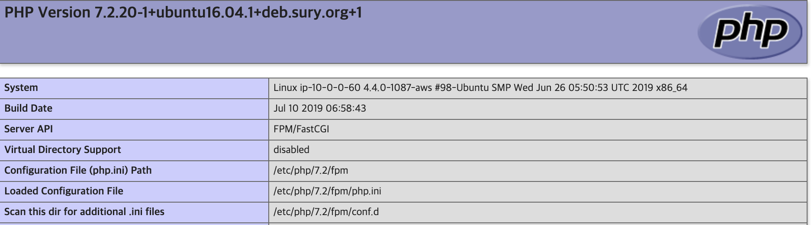

# Simple Nginx/php

## 1. OS & basic info check

```bash
# 리눅스 버전 체크
uname -a

# Ubuntu 버전 체크
cat /etc/issue

# 더 자세한 Ubuntu 버전 체크
lsb_release -a

# 하드용량체크 
df -h

# 메모리 체크
free -m

# CPU 코어수 체크
cat /proc/cpuinfo | grep processor | wc -l
cat /proc/cpuinfo | grep processor

# 자세한 CPU 제원 체크
cat /proc/cpuinfo
```

## 2. Basic Settings

```bash
#패키지  목록 업데이트
apt update

# 설치된 프로그램 최신버전 설치
apt upgrade

# 시스템 시간 설정 ( Asia - Seoul 순으로 선택)
dpkg-reconfigure tzdata
```

## 3. Package Repository 

```bash
# 최신 버전 등록
vi /etc/apt/sources.list
```

아래 코드를 맨아래 추가
```bash
# Nginx
deb http://nginx.org/packages/mainline/ubuntu/ xenial nginx
deb-src http://nginx.org/packages/mainline/ubuntu/ xenial nginx
```


nginx 보안키 다운로드 및 적용

```bash
cd /root
wget http://nginx.org/keys/nginx_signing.key
apt-key add nginx_signing.key
rm nginx_signing.key
```


PPA 개인패키지 저장소를 사용하여 php-7.X 버전 설치



Ubuntu 제작자중 한명이며 Debian에서 일하고 있는 ondrej 저장소를 이용


```bash
apt-get install software-properties-common

add-apt-repository ppa:ondrej/php

# 추가된 보안키 목록 확인
apt-key list

# 추가된 저장소 갱신
apt update
```

## 4. Package Install

### Nginx
```
apt install nginx

service nginx restart
```

여기까지 했을때 Public Ip 로 접근시 아래와 같은 화면이 떠야한다.

> 파일 위치는 /usr/share/nginx/html/index.html


### PHP-FPM

```bash
# 원하는 버전 검색
apt search php

apt install php7.2-fpm
```

`PHP`와 `PHP-FPM` 버전 확인

```
php -v

php-fpm7.2 -v
```


일반적인 PHP 모듈들과 라라벨에서 필요로하는 모듈등 설치

```bash
apt install -y php7.2-cli \
php7.2-common \
php7.2-curl \
php7.2-json \
php7.2-xml \
php7.2-gd \
php7.2-mbstring \
php7.2-mysql \
php7.2-bcmath \
php7.2-dev openssl \
php7.2-zip
```

PHP Default timezone 설정

```bash
vi /etc/php/7.2/fpm/php.ini
vi /etc/php/7.2/cli/php.ini
```

두개의 파일 모두 `date.timezone`을 찾아서 주석해제후 아래와 같이 원하는 timezone 입력


```
service php7.2-fpm restart
```


### Nginx와 PHP-FPM설정

**Nginx 사용자 권한 변경**
```bash
vi /etc/nginx/nginx.conf
```

아래 이미지에서 2번째 라인 user값을 `www-data`로 변경한다


```bash
service nginx restart
```

**Nginx에서 PHP 확장자를 FPM으로 요청하도록 설정**
```bash
vi /etc/nginx/conf.d/default.conf
```

> `default.conf` 파일을 아리 기본구문으로 변경 (기존데이터는 백업)

```xml
server {
    listen       80 default_server;
    server_name  localhost;
    root /var/www/public;


    location / {
        index  index.php index.html;
        try_files $uri $uri/ /index.php?$args;
    }

    # Allow Lets Encrypt Domain Validation Program
    location ^~ /.well-known/acme-challenge/ {
        allow all;
    }

    # Block dot file (.htaccess .htpasswd .svn .git .env and so on.)
    location ~ /\. {
        deny all;
    }

    # Block (log file, binary, certificate, shell script, sql dump file) access.
    location ~* \.(log|binary|pem|enc|crt|conf|cnf|sql|sh|key)$ {
        deny all;
    }

    # Block access
    location ~* (composer\.json|contributing\.md|license\.txt|readme\.rst|readme\.md|readme\.txt|copyright|artisan|gulpfile\.js|package\.json|phpunit\.xml)$ {
        deny all;
    }

    location ~ [^/]\.php(/|$) {
        fastcgi_split_path_info ^(.+?\.php)(/.*)$;
        if (!-f $document_root$fastcgi_script_name) {
            return 404;
        }

        fastcgi_pass unix:/run/php/php7.2-fpm.sock;
        fastcgi_index index.php;
        include fastcgi_params;
    }
}
```

**fastcgi_params 변경**

```bash
vi /etc/nginx/fastcgi_params
```
> `fastcgi_params` 파일을 변경

```
fastcgi_param   QUERY_STRING            $query_string;
fastcgi_param   REQUEST_METHOD          $request_method;
fastcgi_param   CONTENT_TYPE            $content_type;
fastcgi_param   CONTENT_LENGTH          $content_length;
 
fastcgi_param   SCRIPT_FILENAME         $document_root$fastcgi_script_name;
fastcgi_param   SCRIPT_NAME             $fastcgi_script_name;
fastcgi_param   PATH_INFO               $fastcgi_path_info;
fastcgi_param   PATH_TRANSLATED         $document_root$fastcgi_path_info;
fastcgi_param   REQUEST_URI             $request_uri;
fastcgi_param   DOCUMENT_URI            $document_uri;
fastcgi_param   DOCUMENT_ROOT           $document_root;
fastcgi_param   SERVER_PROTOCOL         $server_protocol;
 
fastcgi_param   GATEWAY_INTERFACE       CGI/1.1;
fastcgi_param   SERVER_SOFTWARE         nginx/$nginx_version;
 
fastcgi_param   REMOTE_ADDR             $remote_addr;
fastcgi_param   REMOTE_PORT             $remote_port;
fastcgi_param   SERVER_ADDR             $server_addr;
fastcgi_param   SERVER_PORT             $server_port;
fastcgi_param   SERVER_NAME             $server_name;
 
fastcgi_param   HTTPS                   $https;
 
# PHP only, required if PHP was built with --enable-force-cgi-redirect
fastcgi_param   REDIRECT_STATUS         200;
```

```bash
service nginx restart
```

여기까지 했을때 `phpinfo()`를 통해 FPM 적용여부를 확인할 수 있다.




## 5. Laravel Settings

```bash
# 1. composer 설치
curl -s http://getcomposer.org/installer | php && \
  echo "export PATH=${PATH}:/var/www/vendor/bin" >> ~/.zshrc && \
  mv composer.phar /usr/local/bin/composer

# 2. 라라벨 인스톨러 설치
composer global require laravel/installer

# 3. $PATH 에 추가
export PATH=~/.composer/vendor/bin:$PATH

# 4. laravel
laravel new test
```

> storage permission 관련 에러시 아래 실행

```bash
chown -R $USER:www-data storage
chown -R $USER:www-data bootstrap/cache
chmod -R 775 storage
chmod -R 775 bootstrap/cache
```


## 6. MySQL 5.5 install

### 1. 설치사양

- Ubuntu.16.04 LTS
- MySQL 5.5 

### 2. 설치

여기서부터는 별도의 EC2에 설치한다 (mysql 전용으로만 사용할 EC2를 새로  생성한 후 진행)

16.04에서 기본적으로 제공하는 MySQL은 5.7 버전이므로 apt를 통해 설치하지 않고 직접 다운로드 받아서 진행

```bash
# root 계정으로 진행

# mysql 유저와 그룹생성
groupadd mysql
useradd -g  mysql mysql

# 5.5 버전 다운로드 및 압축해제
cd /root

wget https://dev.mysql.com/get/Downloads/MySQL-5.5/mysql-5.5.56-linux-glibc2.5-x86_64.tar.gz
tar -xvf mysql-5.5.56-linux-glibc2.5-x86_64.tar.gz /usr/local

cd /usr/local

mv mysql-5.5.56-linux-glibc2.5-x86_64 mysql

# mysql 그룹/유저 설정
cd mysql
chown -R mysql:mysql *

# 필요한 lib 패키지 설치
apt install libaio1

# install script 실행
scripts/mysql_install_db --user=mysql

chown -R root .
chown -R mysql data

cp support-files/my-medium.cnf /etc/my.cnf 

# Start Mysql
bin/mysqld_safe --user=mysql &
cp support-files/mysql.server /etc/init.d/mysql.server

# root 패스워드 설정
bin/mysqladmin -u root password '1234'

# Start mysql seerver
/etc/init.d/mysql.server start

# Stop mysql server
/etc/init.d/mysql.server stop

# Check status of mysql
/etc/init.d/mysql.server status

#Enable myql on startup
update-rc.d -f mysql.server defaults 

#Disable mysql on startup
update-rc.d -f mysql.server remove

# 심볼릭 링크
ln -s /usr/local/mysql/bin/mysql /usr/local/bin/mysql

# 접속
mysql -uroot -p1234
```

### 3. 외부 접속 허용

```bash
vi /etc/my.cnf
```
`my.cnf`파일에 `bind-address = 0.0.0.0` 추가 ( 이미 있다면 변경 )


EC2에 SSH로 mysql에 접속해서 외부 접속할 계정 권한 설정
```mysql
grant all privileges on *.* to root@'%' identified by '1234';
```
