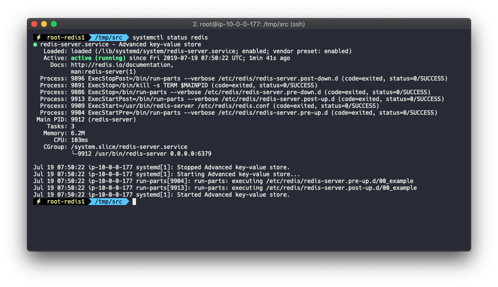

# Simple Redis

## 1. 설치사양

* Ubuntu.16.04 LTS
* Redis

## 2. 설치

> root 계정으로 진행한다

```bash
apt-get install redis-server


# 상태확인
systemctl status redis
```

아래와 같이 active 상태로 나오면 정상작동



```bash
# redis 시작
systemctl start redis-server.service

# redis 재시작
systemctl restart redis-server.service

# 서버 재시작후 자동으로 redis 시작
systemctl enable redis-server.service
```

## 3. redis 설정

* bind
* requirepass
* maxmemory
* maxmemory-policy

```bash
vi /etc/redis/redis.conf
```

### 1. bind

외부접속을 위해 `bind` 부분을 찾아 `0.0.0.0`으로 변경


### 2. requirepass

암호설정시 `requirepass`를 찾아 주석해제후 기본값을 지우고 원하는 비밀번호를 입력

### 3. memory

`maxmemory`는 EC2 전체 메모리에서 Redis가 최대 얼마까지 사용할지 여부를 설정 `maxmemory-policy`는 최대 사용 메모리를 초과하게 될때 데이터를 어떻게 삭제할지를 정의한다.



```text
# allkeys-lru 는 가장 오래된 데이터를 지워서 메모리 확보
maxmemory-policy allkeys-lru
```



```bash
#설정파일 변경후 재시작
systemctl restart redis-server.service

# 외부접속 허용여부 확인
netstat -nlpt | grep 6379
```

외부 EC2에서 Redis에 직접 접속하고 싶을경우 해당 서버에 redis-client 설치

```bash
apt install redis-tools

redis-cli -h <redis 서버 ip> -p <redis port> -a <password>
```

## 4. Redis Persistance

|  | RDB | AOF |
| :--- | :--- | :--- |
| info | 특정시점 또는 반복적으로 메모리에 있는 전체 데이터를 디스크에 저장 | 명령이 실행 될 때마다 기록 |
| 장점 | 파일크기 작아 로딩시간 빠름 | 텍스트 파일로 백업하므로 손상이 발생해도 수정해볼 여지가 있음 |
| 단점 | 백업시점에 따라 데이터 유실 및 바이너리 파일이므로 손상발생시 식별 사실상 불가 | 모든 명령어가 기록되므로 파일 크기가 큼 |

두가지 모드 장단점이 명확하고 서로 대체가 안되는 부분이 있어 공식적으로는 두가지 모드를 함께 쓰기를 권고하지만 실무에서는 두가지를 모두 안쓰고 별도의 툴을 이용하는 경우도 있다. 예\)카카오

### 1. rdb 설정 \(Snapshotting\)

redis-cli 로 접속하여 명령어로 백업도 가능

```bash
# 실행중인 redis를 블럭시킨 후 디스크에 저장 (데이터가 클 경우 장애 발생할 수 있음)
save

# 자식 프로세스를 생성하여 백그라운드에서 디스크에 저장
bgsave
```

`redis.conf`에서 설정 \( 아래 설정내용은 전부 redis설치후 기본적으로 작성되어 있는 내용\)



```text
# 900초 동안 1번 이상 쓰기 작업이 실행되면 RDB 파일에 저장
save 900 1 

# 300초 동안 10번 이상 쓰기 작업이 실행되면 RDB 파일에 저장
save 300 10

# 60초 동안 10000번 이상 쓰기 작업이 실행되면 RDB 파일에 저장
save 60 10000

# RDB로 데이터 저장시 오류 발생에 대한처리
# yes일 경우 데이터 저장에 실패할 경우 모든 쓰기 요청 거부
# no 일 경우 쓰기 요청은 처리하지만 RDB에 데이터가 저장되지 않음
stop-writes-on-bgsave-error yes

# RDB파일에 대한 압축여부
# yes일 경우 LZF압축 사용
rdbcompression yes

# checksum 여부
# yes일  경우 RDB파일에 checksum을 저장하고 redis가 다시 시작할때 checksum을 실행
# 이때 Checksum이 같지 않을 경우 Redis를 시작하지 않는다.
rdbchecksum yes

# dump 파일 이름
dbfilename dump.rdb

# RDB와 AOF가 저장될 디렉토리 설정
dir /var/lib/redis
```



```text
# yes일 경우 AOF파일을 생성한다.
appendonly no

# The name of the append only file (default: "appendonly.aof")
appendfilename "appendonly.aof"

# AOF 파일에 데이터를 저장할 규칙
# always   : 쓰기가 발생할때 마다 AOF에 데이터를 저장
# everysec : 매 초마다 데이터 저장
# no       : fsync 실행하지 않음
appendfsync everysec
```



RDB와 AOF방식 모두 설정되어 있을 경우 `appendonly` 가 **yes일경우 AOF파일을 사용** **No일 경우 RDB파일을 사용**한다.

