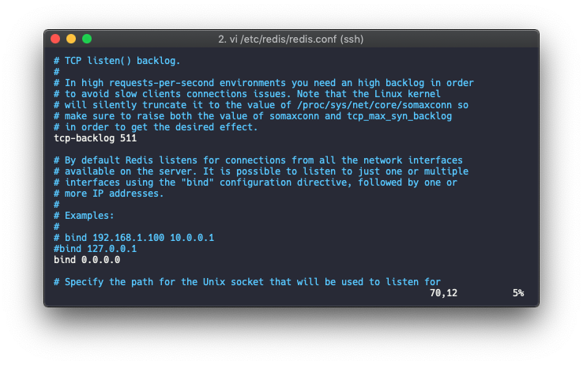

# Simple Redis

## 1. 설치사양

* Ubuntu.16.04 LTS
* MySQL 5.5 

## 2. 설치

> root 계정으로 진행한다

```bash
apt-get install redis-server


# 상태확인
systemctl status redis
```

아래와 같이 active 상태로 나오면 정상작동


```bash
# redis 시작
systemctl start redis-server.service

# redis 재시작
systemctl restart redis-server.service

# 서버 재시작후 자동으로 redis 시작
systemctl enable redis-server.service
```

## 3. redis 설정

- bind
- requirepass
- maxmemory
- maxmemory-policy

```bash
vi /etc/redis/redis.conf
```

### 1. bind
외부접속을 위해 `bind` 부분을 찾아 `0.0.0.0`으로 변경



### 2. requirepass

암호설정시 `requirepass`를 찾아 주석해제후 기본값을 지우고 원하는 비밀번호를 입력

### 3. memory

`maxmemory`는 EC2 전체 메모리에서 Redis가 최대 얼마까지 사용할지 여부를 설정
`maxmemory-policy`는 최대 사용 메모리를 초과하게 될때 데이터를 어떻게 삭제할지를 정의한다.



```xml
# allkeys-lru 는 가장 오래된 데이터를 지워서 메모리 확보
maxmemory-policy allkeys-lru
```




```bash
#설정파일 변경후 재시작
systemctl restart redis-server.service

# 외부접속 허용여부 확인
netstat -nlpt | grep 6379
```

외부 EC2에서 Redis에 직접 접속하고 싶을경우 해당 서버에 redis-client 설치

```bash
apt install redis-tools

redis-cli -h <redis 서버 ip> -p <redis port> -a <password>
```

## 4. redis 기본문법

Client GUI Tool 은 `rdbtools` 사용

```bash
# key value 형태로 입력
set backend php

# key로 데이터 찾기
get backend

# key로 검색
keys *<검색어>*

# 모든 key 확인
keys *
```