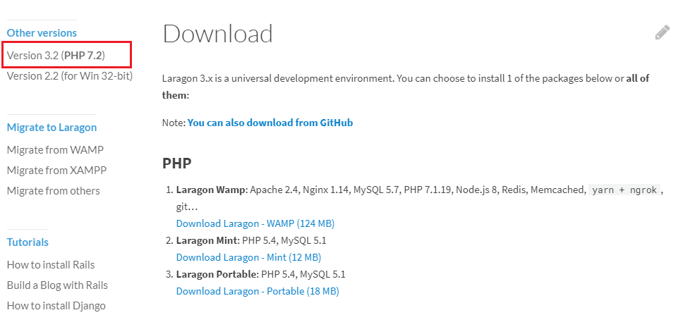

# Get Started

## 1. Development environment setting

### local environment

#### Mac 환경 \(권장\)

#### 윈도우 환경 \(비추\)

로컬 개발환경 셋팅은 여러가지 방법이 있지만 대표적으로 다음과 같은 방법이 있다

* docker
* Homestead
* apm, bitnami, laragon 등의 이미 구성되어있는 패키지 설치 \(PHP+Apache+Mysql 등이 이미 구성되어있으며 대다수 윈도우 환경에도 설치 프로그램을 지원한다\)

각각 장단점이 있지만 대체적으로 상기 리스트의 위로 갈수록 설정이 복잡하지만 그만큼 운영과 거의 동일한 환경을 구축할 수 있고, 아래로 갈수록 설정은 간단하지만 그만큼 기능이 한정되고 딱 로컬개발환경 정도다

[laragon](https://laragon.org/)을 설치후 설치된 경로 내부의 php.exe를 환경변수로 잡아준다  


만약 checkout이나 소스 연동 문제로 `정의로 이동` 기능이 작동 안할경우 아래 커맨드로 갱신


