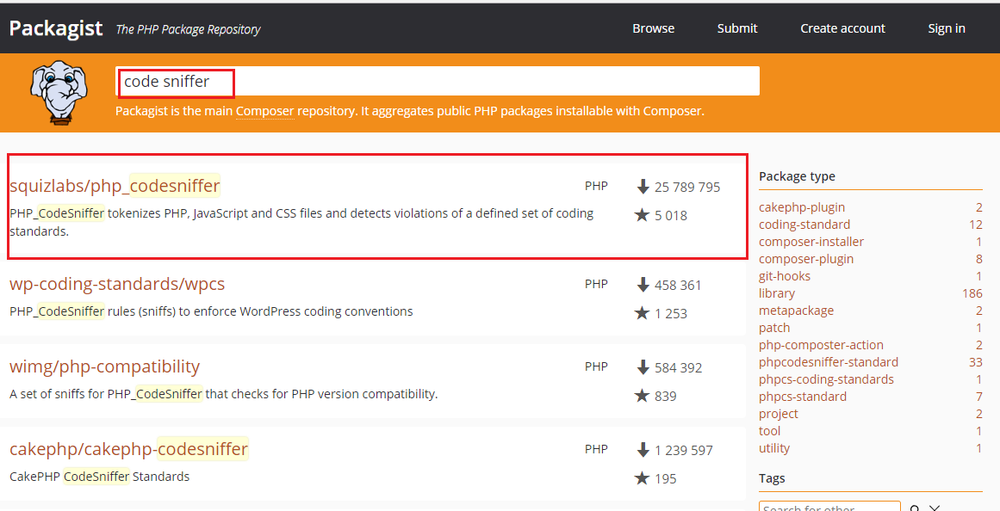

# PhpStorm

## 1. ide-helper

IntelliJ 계열 \(PHPStorm 포함\)에서 Laravel 문법에 대한 지원이 아직 완벽하지 않아서 Route의 컨트롤러를 찾지 못한다거나 Facade를 찾아가지 못하는 등의 불편한 사항들을 해결해주는 패키지

[laravel-ide-helper Github repository](https://github.com/barryvdh/laravel-ide-helper)

### 1-1. install

```bash
# composer package 설치
composer require --dev barryvdh/laravel-ide-helper
```


만약 Laravel 5.5 이상을 사용할경우 패키지를 `Auto-Discovery` 하므로 하 과정 생략가능


`config/app.php` 파일의 `providers` 배열에 해당 클래스 추가

```bash
Barryvdh\LaravelIdeHelper\IdeHelperServiceProvider::class
```

```php
// 상기 방법처럼 수동으로 등록하거나 혹은 아래와 같은 방법으로 처리 가능
// app/Providers/AppServiceProvider.php

public function register()
{
  if($this->app->environment() !== 'production') {
    $this->app->register(\Barryvdh\LaravelIdeHelper\IdeHelperServiceProvider::class);
  }
}
```


만약 checkout이나 소스 연동 문제로  `Go to Definition` 기능이 작동 안할경우 아래 커맨드로 갱신


```bash
php artisan ide-helper:generate
```

이때 생성되는 ide-helper 파일은 `.gitignore` 에 등록해서 공유제외

## 2. ~~IDE Custom formatting \(비추 \)~~

~~IntelliJ Preferences &gt; Editor &gt; Code Style &gt; PHP~~

~~우측 상단 Set from &gt; predefined style &gt; PSR1/PSR2 클릭~~

~~코드 파일에서 `option + command + l` 입력시 위에서 지정한 코드 포맷 형식으로 변환됨~~

~~IDE 기본 제공기능인만큼 기능이 부족해서 codesniffer 와 php-cs-fixer를 사용하기를 권장함~~

## 3. Code Sniffer & php-cs-fixer


~~기존에는 php cs fixer 사용을 더 권장했지만 PSR-12 릴리즈되 면서 현재시점기준으로\(2019-10-16일\) code sniffer가 먼저 적용을 해줘서 code sniffer를 사용하는걸 권장한다.~~  
php-cs-fixer 에서 PSR-12 룰셋을 제공해주진 않지만 옵션설정으로 셋팅할 수 있다고 한다.\( 2020-01-22\)




[Codesniffer Github repository](https://packagist.org/packages/squizlabs/php_codesniffer)

### 3.1 Code Sniffer install

```bash
composer global require "squizlabs/php_codesniffer=*"
```

`Preferences` &gt; `Editor` &gt; `Inspections` &gt; `PHP` &gt; `Quality tools` &gt; `PHP Code Sniffer validation` 체크

Coding standard는 `PSR12`로 지정

### 3.2 Code Sniffer Configure

```bash
# phpcs 경로 복사
$ which phpcs
/Users/{username}/.composer/vendor/bin/phpcs
```

`Preferences` &gt; `Language & Frameworks` &gt; `PHP` &gt; `Quality tools` &gt; `Code Sniffer configuration` 클릭 팝업창이 뜨면 `PHP Code Sniffer path` 란에 위에서 복사한 경로 붙여넣기 후 오른쪽 Validate 체크

`Preferences` &gt; `Editor` &gt; `Inspections` &gt; `PHP` &gt; `Quality tools` &gt; `PHP Code Sniffer validation` &gt; 우측 설정창의 `Coding standard` `PSR12`로 설정되어 있는지 확인


`레거시 프로젝트의 경우 PSR 체크를 하면 너무 많은 에러가 뜨니 Serverity` 는 `ERROR`로 설정 \( Weak Warning 부터는 너무 많은 경고 출력되므로\)하는 것도 방


### 3.3 Cs-Fixer install

[php-cs-fixer Github repository](https://packagist.org/packages/friendsofphp/php-cs-fixer)

```bash
composer global require friendsofphp/php-cs-fixer
```

```bash
# php-cs-fixer 경로 복사
$ which php-cs-fixer
/Users/{username}/.composer/vendor/bin/php-cs-fixer

# php-cs-fixer fixer -h 로 옵션 확인 가능
```

`Preferences` &gt; `Language & Frameworks` &gt; `PHP` &gt; `Quality tools` &gt; `PHP CS Fixer configuration` 클릭 팝업창이 뜨면 `PHP CS Fixer path` 란에 위에서 복사한 경로 붙여넣기 후 오른쪽 `Validate` 체크

### 3-4. Usage

inline 방식

```bash
# php-cs-fixer option Rule로 변경
fix --rules=@PSR2,@Symfony,no_unused_imports,indentation_type $FileDir$/$FileName$
```


위와 같이 터미널에 입력하는 형식으로 사용가능하지만 편의상 IDE에 등록후 각종 Rule을 config file로 작성한후 단축키를 이용하여 사용하길 권장


IDE에 등록하여 사용하는 방식

`Preferences` &gt; `Tools` &gt; `External Tools` &gt; `+` 버튼 클릭

PHP Code Sniffer 하단의 항목 작성

> `Program` : phpcbf 경로 지정 \(터미널에서 which phpcbf\)
>
> `Arguments` : --standard=PSR12 $FileDir$/$FileName$
>
> `Working directory` : $ProjectFileDir$

PHP CS Fixer Tool Settings 하단의 항목 작성

> `Program` : php-cs-fixer 경로 지정 \(터미널에서 which php-cs-fixer\)
>
> `Arguments` : fix --verbose --config={설정파일경로}/.php\_cs $FileDir$/$FileName$
>
> `Working directory` : $ProjectFileDir$

`Arguments :` diff \(변경된점\), 혹은 dry-run \(실행하지 않고 어떻게 변경될지 알려줌\)등의 옵션을 추가해서 상황에 맞게 사용가능하다



`Advanced Options`의 `Open console for tool output`을 체크 해제 하지 않으면 매번 cs-fixer를 실행할때마다 output 창이 열려서 불편하므로 보통은 체크해제 후 사용하지만 fixer가 정상적으로 작동하지 않아 에러메시지를 보고 싶을경우 체크 후 확인하는 용도로 사용한


`Arguments` 예시


`Preferences` &gt; `Keymap` &gt; `PHP CS Fixer` 에 원하는 단축키 지정 후 사용

예\) ⌥ + F 사용

[.php\_cs config file 다운로드](https://gist.github.com/smc0210/b107f968671012cb454ae01dbdd588d3)

`.php_cs 예시`

```php
<?php

// 설정파일 경로는 보통 프로젝트의 루트 경로에 둔다 ( composer.json과 같은 경로)
use PhpCsFixer\Config;
use PhpCsFixer\Finder;
$finder = Finder::create()
    ->notPath('bootstrap/cache')
    ->notPath('storage')
    ->notPath('vendor')
    ->in(__DIR__)
    ->name('*.php')
    ->notName('*.blade.php')
    ->ignoreDotFiles(true)
    ->ignoreVCS(true);

// 기본룰은 Symfony와 PSR2를 기본으로 하되 그외 추가적인 옵션들만 배열에 추가
// 옵션참고 URL
// https://github.com/FriendsOfPHP/PHP-CS-Fixer
// https://mlocati.github.io/php-cs-fixer-configurator

$config = Config::create()
    ->setRules([
        '@Symfony'                => true,
        '@PSR2'                   => true,
        'array_syntax'            => ['syntax' => 'short'],
        'align_multiline_comment' => ['comment_type'=> 'phpdocs_only'],
        'array_indentation'       => true,
        'no_unused_imports'       => true,
        'binary_operator_spaces'  => [
            'align_double_arrow' => true,
            'align_equals'       => true,
        ],
        'blank_line_after_opening_tag' => true,
    ])
    ->setFinder($finder)
    ->setUsingCache(false);
return $config;
```

## 4. xdebug

[PHPStorm - xdebug 셋팅](https://www.jetbrains.com/help/phpstorm/configuring-xdebug.html)

> php.ini

```markup
; Off -> On 으로 수정
implicit_flush = On


; 최하단에 하기 추가 (경로설정 주의)
[XDebug]
;; Only Zend OR (!) XDebug
zend_extension="C:\laragon\bin\php\php-7.1.14-Win32-VC14-x64\ext\php_xdebug-2.6.0-7.1-vc14-x86_64.dll" xdebug.remote_enable=true
xdebug.remote_host=localhost
xdebug.remote_port=8000
xdebug.remote_handler=dbgp
xdebug.profiler_enable=1
xdebug.profiler_output_dir="C:\laragon\tmp"
```

## 5. phpunit

[https://phpunit.de/getting-started/phpunit-7.html](https://phpunit.de/getting-started/phpunit-7.html)

## 6. PHPStorm Setting

### 6-1. git bash inside phpstorm


**6-1-1.** `Settings` **&gt;** `Tools` **&gt;** `Terminal`

Shell path 란에 입력

#### Windows

```bash
# 32-bit version of Git
"C:\Program Files (x86)\Git\bin\sh.exe" -login -i

# 64-bit version of Git
"C:\Program Files\Git\bin\sh.exe" -login -i
```

> 그래야 bash\_profile 적용되서 환경변수및 기타 설정을 동일하게 쓸 수 있다.

**6-1-2.** `Settings` **&gt;** `Version Control` **&gt;** `Git`

```bash
C:\Program Files (x86)\Git\bin\git.exe

# or this if you're using the 64-bit version of Git:

C:\Program Files\Git\bin\git.exe
```

