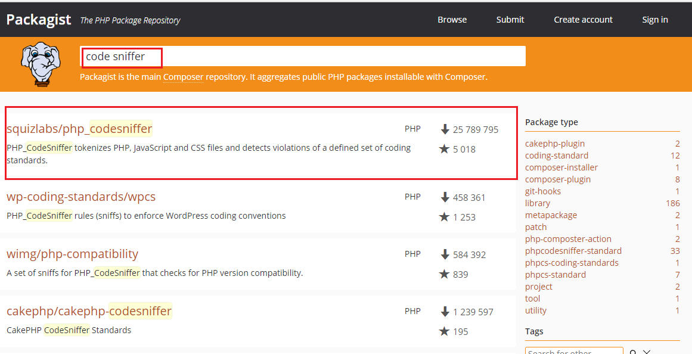
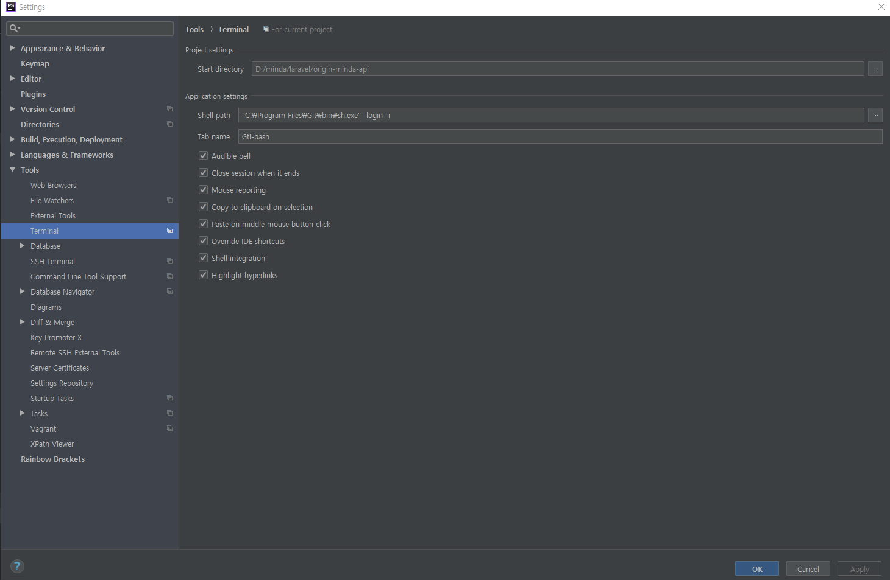

# phpstorm

## TOC

* [phpstorm](phpstorm.md#phpstorm)
  * [TOC](phpstorm.md#toc)
  * [1. ide-helper](phpstorm.md#1-ide-helper)
  * [2. php-cs-fixer](phpstorm.md#2-php-cs-fixer)
    * [2-2. Usage](phpstorm.md#2-2-usage)
  * [3. xdebug](phpstorm.md#3-xdebug)
  * [4. phpunit](phpstorm.md#4-phpunit)
  * [5. PHPStorm Setting](phpstorm.md#5-phpstorm-setting)
    * [5-1. git bash inside phpstorm](phpstorm.md#5-1-git-bash-inside-phpstorm)

## 1. ide-helper

[laravel-ide-helper Github repository](https://github.com/barryvdh/laravel-ide-helper)


만약 checkout이나 소스 연동 문제로 `정의로 이동` 기능이 작동 안할경우 아래 커맨드로 갱신


```bash
php artisan ide-helper:generate
```

## 2. php-cs-fixer

code sniffer 설치 [squizlabs/php\_codesniffer](https://packagist.org/packages/squizlabs/php_codesniffer)

php-cs-fixer 설치 [friendsofphp/php-cs-fixer](https://packagist.org/packages/friendsofphp/php-cs-fixer)



### 2-2. Usage

inline 방식

```text
# php-cs-fixer option Rule로 변경
fix --rules=@PSR2,@Symfony,no_unused_imports,indentation_type $FileDir$/$FileName$
```

config file 방식

```text
# config파일로 설정
fix --config=.php_cs $FileDir$/$FileName$
```

## 3. xdebug

[PHPStorm - xdebug 셋팅](https://www.jetbrains.com/help/phpstorm/configuring-xdebug.html)

> php.ini

```markup
; Off -> On 으로 수정
implicit_flush = On


; 최하단에 하기 추가 (경로설정 주의)
[XDebug] 
;; Only Zend OR (!) XDebug
zend_extension="C:\laragon\bin\php\php-7.1.14-Win32-VC14-x64\ext\php_xdebug-2.6.0-7.1-vc14-x86_64.dll" xdebug.remote_enable=true
xdebug.remote_host=localhost 
xdebug.remote_port=8000
xdebug.remote_handler=dbgp 
xdebug.profiler_enable=1 
xdebug.profiler_output_dir="C:\laragon\tmp"
```

laragon 트레이 아이콘 우클릭 &gt; PHP &gt; Extension 에서 xdebug설정

> chrome 확장도구 설치

[xdebug 크롬확장도구](https://chrome.google.com/webstore/detail/xdebug-helper/eadndfjplgieldjbigjakmdgkmoaaaoc/related)

## 4. phpunit

[https://phpunit.de/getting-started/phpunit-7.html](https://phpunit.de/getting-started/phpunit-7.html)

## 5. PHPStorm Setting

### 5-1. git bash inside phpstorm



**5-1-1.** `Settings` **&gt;** `Tools` **&gt;** `Terminal`

Shell path 란에 입력

```bash
# 32-bit version of Git
"C:\Program Files (x86)\Git\bin\sh.exe" -login -i

# 64-bit version of Git
"C:\Program Files\Git\bin\sh.exe" -login -i
```

> 그래야 bash\_profile 적용되서 환경변수및 기타 설정을 동일하게 쓸 수 있다.

**5-1-2.** `Settings` **&gt;** `Version Control` **&gt;** `Git`

```bash
C:\Program Files (x86)\Git\bin\git.exe

# or this if you're using the 64-bit version of Git:

C:\Program Files\Git\bin\git.exe
```

